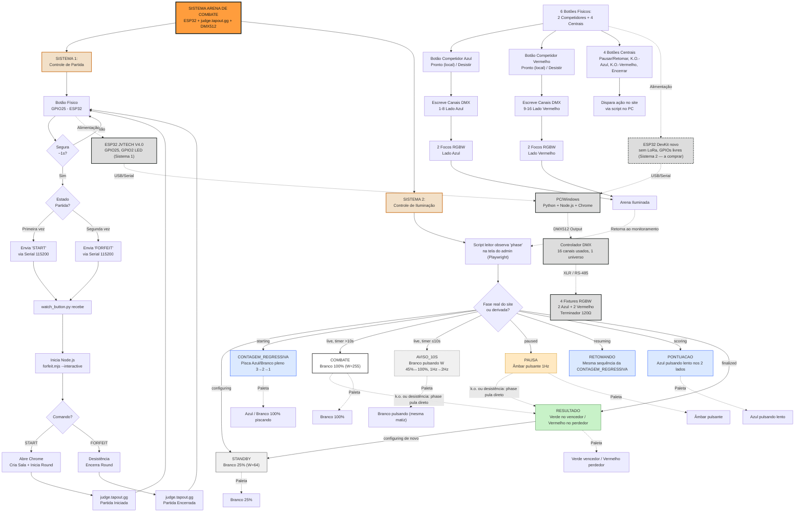

# Contexto completo — Arena de Combate de Robôs (ESP32 + judge.tapout.gg + DMX512)

Este arquivo reúne **tudo** que foi discutido e construído em 3 conversas separadas do
Claude, mais uma sessão de migração para um novo computador. É a fonte de verdade
única do projeto — cole este arquivo inteiro numa conversa nova do Claude pra
retomar o trabalho do zero, sem perder nada do histórico de decisões.

Última atualização: 2026-09-02.

> **🧾 Log de validação por luta + bateria extensa de testes (2026-09-02, ver
> seção 2d):** novo módulo `match_logger.mjs`, separado da lógica
> principal, gera 1 `.txt` por luta com todo input identificado (juízes,
> central/mouse, botões físicos) com horário exato — testado com admin + 3
> juízes reais, duração normal de luta, cross-check linha a linha 100%
> correto (2d.1). Depois, uma segunda rodada (2d.2) testou limite de tempo
> nos últimos instantes da luta, comandos fora de ordem, **3 lutas seguidas
> na mesma sala** trocando nome/categoria (timer, desistência e K.O.), e o
> caso dos 2 competidores apertando ao mesmo tempo (200/200 repetições sem
> falha). Dois bugs reais encontrados e corrigidos nessa rodada toda. Lista
> de falhas do lado do site (pra mandar pro Barreto) em
> `Arenas/erros_e_falhas_tapout.txt`.

> **✅ Validação extensa feita em 2026-08-27 (ver seção 2c):** lógica de
> debounce simulada e testada (10/10), um bug real encontrado e corrigido no
> `forfeit.mjs` (comando perdido depois do 1º forfeit), pinagem corrigida
> (conflito de GPIO4) e MOSFET atualizado pra IRF540N (já validado
> fisicamente pelo Erik), e testes ao vivo no site com múltiplos juízes —
> inclusive **um método de recuperação rápida se um juiz cair e não
> reconectar**, seção 2c.7.

> **🚨 ESCOPO SIMPLIFICADO — competição é sexta-feira, ver seção 2b.** O design
> completo das seções 4-7 (13→8 estados, DMX512, 6 botões) não vai dar tempo.
> Erik cortou pra um MVP: 1 botão + 1 luz + 1 fita RGB **por competidor**, sem
> painel central, sem juízes físicos, sem leitura automática da fase do site.
> **Firmware já escrito e compilado com sucesso** em `esp32-arena/` no
> repositório privado, junto com `forfeit.mjs` atualizado (time dinâmico) e o
> novo `watch_arena.py`. Ver seção 2b pra lógica completa, pinagem, e o que
> ainda falta testar fisicamente antes de sexta.

> **Atualização (2026-08-26): conversa com o Berken (colega no projeto) lida na
> íntegra.** Resolve a dúvida anterior sobre o botão cogumelo (substituído pelo
> `P20AMR-B-1A` no escopo simplificado, ver 2b) e traz informação nova sobre a
> escala real do projeto — **são 3 arenas, não 1** — e sobre uma integração via
> API do tapout.gg em andamento. Ver seção 2a (escala e logística).

> **Nota de correção (2026-08-25):** circulou uma versão de diagrama (mermaid.live)
> com um estado **"EMPATE"** e um estado **"NOCAUTE"** separados, faltando
> **PAUSA/RETOMANDO** e **CONTAGEM_REGRESSIVA**, e com uma paleta de cores antiga
> (amarelo pro aviso, ciano pro scoring). Isso **não reflete as regras/decisões
> atuais** — em especial, **não existe empate** pelas regras oficiais da RoboCore
> (seção 4.1) e a paleta foi revisada pra 4 matizes + branco (seção 4.3). O diagrama
> corrigido está na seção 4.4a abaixo. Use sempre este documento como fonte de
> verdade, não diagramas soltos.

---

## Sumário

1. [Visão geral do projeto](#1-visão-geral-do-projeto)
2. [Sistema 1: botão físico → judge.tapout.gg (`tapout-forfeit-trigger`)](#2-sistema-1-botão-físico--judgetapoutgg)
   - [2a. Escala do projeto, orçamento e logística do evento](#2a-escala-do-projeto-orçamento-e-logística-do-evento)
   - [2b. 🚨 ESCOPO SIMPLIFICADO PRA SEXTA-FEIRA](#2b-escopo-simplificado-pra-sexta-feira-prioridade-máxima-atual)
   - [2c. ✅ Validação 2026-08-27 (firmware, integração, site, recuperação de juiz)](#2c-validação-feita-em-2026-08-27--lógica-do-firmware-integração-e-site-real)
   - [2d. 🧾 Log de validação por luta (`match_logger.mjs`)](#2d-log-de-validação-por-luta-match_loggermjs)
3. [Mapa de comportamento real do site judge.tapout.gg](#3-mapa-de-comportamento-real-do-site-judgetapoutgg)
4. [Sistema 2: controlador de iluminação DMX512 da arena](#4-sistema-2-controlador-de-iluminação-dmx512-da-arena)
   - [4.4a Diagrama visual corrigido (fluxo completo)](#44a-diagrama-visual-corrigido-fluxo-completo)
5. [O que mudou do desenho original pro reconciliado](#5-o-que-mudou-do-desenho-original-pro-reconciliado)
6. [Próximos passos em aberto](#6-próximos-passos-em-aberto)
7. [Conectar fitas de LED no ESP32 — opções pesquisadas](#7-conectar-fitas-de-led-no-esp32--opções-pesquisadas)
8. [Guia de setup num computador novo (testado e funcionando)](#8-guia-de-setup-num-computador-novo)
9. [Preferências de trabalho do Erik](#9-preferências-de-trabalho-do-erik)

---

## 1. Visão geral do projeto

Erik está construindo a parte elétrica/automação de uma **arena de combate de
robôs**, usada com o site **judge.tapout.gg** (plataforma de arbitragem de lutas).
Há dois sistemas relacionados mas distintos:

1. **`tapout-forfeit-trigger`** — **já implementado, gravado e testado de ponta a
   ponta em duas máquinas diferentes.** Um botão físico num ESP32 controla partidas
   no site via automação de navegador (Playwright): inicia a luta e, com um segundo
   toque, dá desistência do time azul.
2. **Controlador de iluminação DMX512 da arena** — **só design, nada construído
   ainda.** Máquina de estados que acende 4 focos de canto RGBW conforme o estado
   real da luta (lendo a tela do site), com um mapa de 6 botões físicos planejados
   (2 de competidor + 4 centrais).

Existem também, no mesmo diretório de projetos, pastas `esp32_blink` (teste básico
de LED onboard) e `gemini-check` (scripts `.mjs`, propósito não explorado) — não
fazem parte do escopo documentado aqui.

---

## 2. Sistema 1: botão físico → judge.tapout.gg

Repositório GitHub (privado): **https://github.com/erikkachel/tapout-forfeit-trigger**

Um botão físico soldado/conectado num ESP32 controla partidas no site
judge.tapout.gg via automação de navegador (Playwright). O ESP32 não sabe nada sobre
o site — ele só manda uma palavra (`START` ou `FORFEIT`) por Serial/USB pro PC, que é
quem realmente abre o Chrome e clica nos botões certos.

- **1º toque no botão** (segurar ~1s): abre o site, cria a sala, cria a luta e inicia
  o round.
- **2º toque** (segurar ~1s): manda a desistência do time azul ("time 1") e confirma,
  encerrando o round. Depois volta a esperar um novo 1º toque pra próxima partida.

### 2.1 Hardware

- Placa: **ESP32 LoRa da JVTECH, V4.0** (chip ESP32-WROOM-32D, ponte USB-serial
  Silicon Labs CP210x). Não existe documentação pública de pinagem dessa placa — a
  JVTECH só manda por e-mail (contato@jvtech.net.br) depois da compra.
- **Botão usado: GPIO25** (não é o BOOT/GPIO0 nem o EN/RESET — é um terceiro botão
  físico que existe na placa, ativo em LOW, pull-up interno). Foi identificado
  empiricamente: um sketch de diagnóstico monitorava ~20 GPIOs candidatos e imprimia
  só quando o **estado mudava** (edge detection) — detectar por nível estático dá
  falso positivo por ruído em pinos flutuantes. O usuário confirmou visualmente qual
  botão físico correspondia.
- **LED onboard: GPIO2**, controlado via PWM (`ledcSetup` + `ledcAttachPin` +
  `ledcWrite` — a API *antiga*, baseada em canal, não a `ledcAttach(pin, freq, res)`
  nova do Arduino-ESP32 core 3.x; a plataforma `espressif32@7.0.1` usada aqui não tem
  essa função nova, dá erro de compilação se tentar usar). Brilho fixado em **1% do
  máximo** (`LED_BRIGHTNESS = 3` de 255, resolução 8 bits). LED aceso = idle, apaga
  enquanto o botão está sendo segurado.
- Porta serial: **varia por computador** — descubra com:
  ```powershell
  Get-WmiObject Win32_PnPEntity | Where-Object { $_.Name -match 'CP210|CH340|FTDI|USB Serial' }
  ```
  (histórico: COM4 na máquina original, COM7 na segunda máquina de migração)

### 2.2 Firmware (`esp32/src/main.cpp`)

Ao segurar o botão por `HOLD_MS = 1000` ms, alterna entre mandar `"START"` e
`"FORFEIT"` pela Serial (115200 baud), baseado numa variável booleana `matchStarted`
que fica na RAM do chip. **Importante**: essa variável reseta pra `false` toda vez que
o ESP32 reinicia — o que acontece automaticamente sempre que a porta serial é
reaberta (o driver CP210x pulsa DTR/RTS, resetando o EN do chip). Se o watcher cair e
reconectar no meio de um ciclo, o próximo toque volta a ser `START`, não `FORFEIT`.
Isso é esperado — o `watch_button.py` tem reconexão automática mas não tenta "lembrar"
o estado do lado do PC além do processo Node vivo.

Grava com PlatformIO:
```bash
pio run --target upload -d esp32
```
(porta fixa em `esp32/platformio.ini` como `upload_port` — ajustar por máquina)

### 2.3 `forfeit.mjs`

Script Playwright que automatiza o judge.tapout.gg. Roda o **Chrome instalado no
sistema** (`chromium.launch({ channel: 'chrome' })`), NÃO o Chromium que o Playwright
baixaria sozinho — necessário porque o Chromium/"Chrome for Testing" baixado pelo
`npx playwright install chromium` deu bug de carregamento no Windows da máquina
original (erro de SxS/"side-by-side configuration incorrect", mesmo com
`DevOverrideEnable=1` no registro). Usar o Chrome já instalado contornou o problema.
**Por isso o Google Chrome precisa estar instalado normalmente na máquina que roda o
watcher.**

Modos relevantes:
- `--interactive`: fica esperando comandos `START`/`FORFEIT` via stdin, **mantendo a
  mesma aba do navegador entre os dois**. Essencial — o site vincula o estado da
  sala/round (WebRTC/peer) a uma sessão/aba específica; abrir um processo novo por
  ação faz a 2ª ação (desistência) falhar com "Target page has been closed". A
  correção foi ter UM processo Node vivo por partida, com `startMatch()` e
  `doForfeit()` rodando na mesma `page`.
- `--start-only`: cria sala e inicia o round, sem ir até a desistência (modo
  não-interativo antigo, mantido por compatibilidade).
- `--dry-run`: para antes de clicar em "confirmar desistência" de verdade — útil pra
  testar sem registrar nada real no site. **Testar sempre com `--dry-run` antes de
  confirmar uma ação real contra o site de verdade.**
- `--room CODE`: reusa uma sala existente em vez de criar uma nova.
- `--team blue|red`: escolhe quem desistiu sem perguntar no terminal. **"Time 1" =
  blue** (confirmado com o usuário). Hoje está **hardcoded como `blue`** em
  `watch_button.py` — item pendente pra tornar dinâmico (ver seção 6).
- `--headless` / `--close`: o usuário quer navegador **visível** (não headless), o
  watcher nunca passa `--headless`.

O seletor dos botões usa `data-testid` do HTML (não cor nem texto), resistente a
mudanças visuais no site.

### 2.4 `watch_button.py`

Fica com a porta serial aberta o tempo todo, com reconexão automática em caso de erro
transitório (já aconteceu — porta deu "Acesso negado" depois de uma automação rodar,
provavelmente reenumeração USB; o script tenta reabrir sozinho em loop).

- No `"START"`: sobe `node forfeit.mjs --interactive --team blue` com stdin em pipe,
  guarda a referência do processo, escreve `"START\n"` no stdin dele.
- No `"FORFEIT"`: escreve `"FORFEIT\n"` no stdin do **mesmo** processo (não sobe um
  novo), depois esquece a referência (pra próxima partida subir um processo novo).
- Resolve o caminho do `node.exe` via `shutil.which("node")` — desde que o Node
  esteja no PATH normal do sistema, funciona sem configuração extra.

Rodar:
```bash
python watch_button.py
```

### 2.5 Lições/gotchas gerais

- Se o Windows Installer (winget) falhar com "Another installation is already in
  progress" / erro `0x80070656`, é uma instalação MSI zumbi travada — não adianta
  repetir, cair direto pra versão `.zip` portátil da ferramenta.
- Abrir a porta serial (pyserial ou `pio device monitor`) **reseta o ESP32** (toggle
  de DTR/RTS). Sempre fechar processos anteriores que estejam segurando a porta antes
  de abrir de novo, senão dá "Acesso negado" / porta ocupada.
- O watcher (`watch_button.py`) precisa ficar **rodando em background** pro botão
  funcionar. Se a sessão do terminal reiniciar, o processo Python morre e precisa ser
  religado manualmente.
- O driver **Silicon Labs CP210x** não vem pronto no Windows — se o ESP32 aparecer
  com erro no Gerenciador de Dispositivos (sem porta COM), baixar o instalador oficial
  em silabs.com (`CP210x_Windows_Drivers.zip`, contém `CP210xVCPInstaller_x64.exe`) e
  instalar. Depois disso o Windows já reconhece a porta COM automaticamente.

---

## 2a. Escala do projeto, orçamento e logística do evento

Informação extraída de uma conversa de WhatsApp entre Erik e **Berken** (colega
trabalhando no projeto junto), lida na íntegra em 2026-08-26. Cobre pontos que não
tinham aparecido em nenhum documento anterior.

### 2a.1 São 3 arenas, não 1

Todo o design documentado nas seções 3-6 deste arquivo foi pensado pra **1 arena**.
Na prática, o evento vai ter **3 arenas simultâneas**. Berken perguntou "vão ser
quantas arenas total?" e Erik confirmou: **3**. Isso significa que, quando o
firmware/hardware do Sistema 2 (iluminação) estiver pronto, ele precisa ser
replicável 3x — o design em si não muda, mas a lista de compras e o tempo de
montagem sim.

Cada arena precisa do seu próprio ESP32 pro Sistema 1 (botão de partida). Erik:
"como o esp é meio barato, eu pegaria uns 2 por arena" — ou seja, **2 ESP32 por
arena** (redundância/sobressalente, já que a placa é barata), **6 ESP32 no total**
só pro Sistema 1. Ainda não fechado quantos ESP32 adicionais o Sistema 2
(iluminação DMX) vai precisar por arena — depende do design final do firmware
único (seção 4.2).

Há uma 3ª pessoa, **André**, dona/responsável por uma dessas arenas — Erik mandou
mensagem pra confirmar os specs da arena dele, resposta ainda pendente no momento
da conversa. **Antes de fechar a lista de compras de ESP32, confirmar com o André.**

### 2a.2 Orçamento — sem valor fixo, minimizar gasto

Não existe um orçamento fechado. Berken tentou orçar mas achou difícil sem ver
preços na loja; Erik pediu pra "tentar ter bom senso e gastar o mínimo possível".
Guias que emergiram da conversa:
- **O botão do competidor foi o item mais caro até agora** (~R$40 e poucos reais
  cada, 2 unidades já compradas) — e é o componente que **"não pode dar errado"**
  (maior exigência de confiabilidade do sistema todo).
- Pro resto (placa perfurada, ESP32s, fio, LEDs), a ideia é gastar o mínimo
  necessário, sem economias que comprometam confiabilidade.
- **Iluminação nova não é prioridade.** Uma das arenas ("arena da wicked" — de
  outro grupo/dono) já veio com um kit pronto: 4 luminárias de LED tipo
  painel/plafon + parafusos + cintas + material de fixação (foto: "Isso é o que
  veio com a arena da wicked"). Berken perguntou se não valeria a pena fazer
  iluminação nova; Erik respondeu que **não**: "Não vou gastar 1 centavo a mais do
  que o necessário na arena deles" — e o material que veio com aquela arena
  **precisa ficar com os donos dela** ("tem q deixar tudo com eles"), não é do
  Erik pra reaproveitar livremente nas outras arenas.
- As fitas de LED endereçável que já foram compradas por Erik "acharam meio
  fracas" — pode precisar trocar por LED mais forte. Mas **não é bloqueante**: "no
  ano passado não tinha nenhum LED e deu certo" — ou seja, o evento já rodou sem
  nenhuma iluminação especial antes, então o Sistema 2 (DMX/iluminação) é uma
  melhoria desejável, não um requisito crítico pra o evento acontecer.

### 2a.3 Integração via API do tapout.gg em andamento (Barreto)

Ponto potencialmente importante pro futuro do Sistema 2: Erik mencionou que falou
com uma pessoa chamada **Barreto** sobre a "integração do tapout" — Barreto disse
que **até o fim do fim de semana ele faz a API de integração**. Não há mais
detalhes na conversa sobre o que essa API expõe.

**Isso pode mudar a abordagem técnica documentada nas seções 3.6 e 4.5** (que hoje
descrevem ler o `phase`/cronômetro/placar via texto visível na tela, accessibility
tree, porque não se sabia se existiam `data-testid` dedicados) — se o Barreto
entregar uma API de verdade, o script leitor do Sistema 2 poderia consumir eventos
estruturados em vez de fazer scraping de DOM, o que seria mais robusto. **Vale
confirmar com o Erik/Barreto o que essa API oferece antes de investir tempo
implementando o parsing por accessibility tree.**

### 2a.4 Botão físico dos juízes pra pausa de urgência (ideia nova)

Berken sugeriu: "É bom ter um botão que os juízes possam usar pra pausar a luta" —
"Não sei se seria só pelo tapout com o celular, acho que seria bom pensar em algo
físico mais 'pra urgência'". Berken disse que ia procurar vídeos/referências de
como a arena oficial da RoboCore faz isso. **Não estava no design anterior**
(seção 4.6 documenta só os 4 botões centrais operados pelo árbitro principal,
sem um botão de pausa dedicado aos juízes) — é uma ideia em aberto, não uma
decisão fechada.

### 2a.5 Transmissão ao vivo e câmeras (fora do escopo do ESP32, mas parte do evento)

- Cada arena vai ter webcam. **2 das 3 arenas** vão ficar com um iPhone em live
  aberta, sem interface nenhuma na tela, transmitindo a imagem pra quem está na
  **3ª arena** conseguir acompanhar as outras duas.
- Preocupação: iPhone pode sofrer com **superaquecimento** em uso prolongado como
  câmera de transmissão contínua ("tem q ficar esperto que vai dar overheat e o
  iphone vai desligar"). Alternativa considerada: câmera de ação tipo GoPro com
  ventosa, que é o mais comum pra esse uso (gravar de cima pra estudar/treinar
  depois).
- Erik também quer uma câmera fixa **de cima**, apontando pra baixo, gravando as
  lutas — motivo: quer montar um **heatmap** de dados das lutas, potencialmente
  reaproveitável pro projeto pessoal do TCC do Erik (fazer um robô 100% autônomo
  competitivo — "meu sonho ano que vem é competir sem competir... eu largo o robô
  na mão de alguém e peço só pra ligar ele na arena. Aí ele luta sozinho."). Esse
  objetivo pessoal é uma motivação de fundo, não faz parte do escopo de entrega
  do projeto da arena em si.
- Ângulo de câmera preferido: **meio próximo** ("nem muito de longe"); câmera fixa
  é melhor que rolando se não der pra ter alguém dedicado filmando.
- A transmissão pausa no horário de almoço e reabre quando a operação volta.
- Ainda precisa resolver: onde gravar (notebook dedicado, o mesmo PC que roda o
  tapout, ou o notebook do Berken) e, se for webcam com cabo curto (1-1,5m), talvez
  precise de um **extensor USB**.

---

## 2b. ESCOPO SIMPLIFICADO PRA SEXTA-FEIRA (prioridade máxima atual)

**A competição é sexta-feira. Não dá tempo de fazer o design completo das
seções 4-7 (13→8 estados, DMX512, 6 botões, focos de canto).** Erik decidiu
cortar pra um escopo mínimo, já com firmware escrito, compilado com sucesso, e
publicado no repositório privado (`tapout-forfeit-trigger`, pasta
`esp32-arena/` + `watch_arena.py` + `forfeit.mjs` atualizado). As seções 4-7
abaixo continuam documentando o design completo original — não foram
descartadas, só **adiadas pra depois de sexta**. Este é o escopo que vale
**agora**.

### 2b.1 O que ficou (por competidor, não mais por "grupo central")

- **1 botão** por competidor: modelo **Metaltex `P20AMR-B-1A`** (sem
  retenção/momentâneo — diferente do cogumelo trava-e-gira cogitado antes),
  contato **NA** nativo, mais um módulo **`M20-1B`** adicionado a cada botão
  pra ganhar um segundo contato **NF** no mesmo atuador físico.
- **1 luz de sinalização** por competidor: **Metaltex `L20-AR7-GP`** — LED
  verde, **24V CA/CC**, corrente **< 20mA**, driver/resistor já integrado ao
  corpo (não precisa resistor externo), furo de fixação Ø22,3mm (mesmo padrão
  do botão P20, encaixam lado a lado no painel). Datasheet oficial confirmado:
  [`l20-r.pdf` (Metaltex)](https://arquivo.metaltex.com.br/produtos/pdf/l20-r.pdf).
- **1 fita RGB de 12V** por competidor (2 no total) — kit comercial que veio
  com controle remoto sem fio e uma placa receptora `ALS-001-V1`. **Vamos
  pular a placa receptora e o controle remoto de vez** — o ESP32 aciona a
  fita direto.
- **Juízes**: sem botão nem luz dedicada — usam celular (Tapout), como já
  estava decidido antes.
- **Cortado do escopo de sexta**: os 4 botões centrais (pausar/retomar,
  k.o.-azul, k.o.-vermelho, encerrar), os 4 focos de canto DMX512/RS-485, e
  qualquer leitura automática da fase do site pro controle de luz.

### 2b.2 Lógica do botão — validação dupla NA+NF (por que e como)

Objetivo do Erik: ter certeza absoluta que um evento de desistência é real —
não ruído elétrico, não bug de firmware. Com os dois contatos ligados ao
mesmo atuador físico:

| Estado do botão | Contato NA | Contato NF | GPIO_NA (pull-up) | GPIO_NF (pull-up) |
|---|---|---|---|---|
| Solto | aberto | fechado | HIGH | LOW |
| Pressionado | fecha | abre | LOW | HIGH |

Nos dois estados válidos, **NA e NF são sempre opostos**. Regra de validação
no firmware: `GPIO_NA != GPIO_NF` → leitura confiável, aceita; `GPIO_NA ==
GPIO_NF` → leitura inválida (ruído, mau contato, ou o instante mecânico da
troca entre os 2 blocos) → descartada, sem mudar de estado. Além disso, uma
mudança só é aceita como definitiva depois de ficar estável por 25ms
(`DEBOUNCE_MS`), filtrando bounce mecânico.

### 2b.3 Gesto do botão e fluxo da luta (decisões confirmadas com o Erik)

- **Toque simples alterna estado** (não precisa segurar, diferente do
  `HOLD_MS=1000` do Sistema 1 original).
- **1º toque** = "pronto": acende a luz L20 daquele lado; manda
  `READY_BLUE`/`READY_RED` pela Serial (só informativo).
- **2º toque** = desistência: apaga a luz L20 daquele lado; fita RGB daquele
  lado fica **vermelha**, fita RGB do outro lado fica **verde**; manda
  `FORFEIT_BLUE`/`FORFEIT_RED` pela Serial.
- **1º toque de um novo ciclo** (depois de uma desistência anterior): as duas
  fitas voltam a apagar antes de marcar o novo "pronto".
- **Quem inicia a luta de verdade**: o **admin**, manualmente, digitando
  `start` + ENTER no terminal do `watch_arena.py` — aciona a MESMA automação
  Chrome (`forfeit.mjs --interactive`) que já existia, só que sem o gatilho
  automático dos "2 prontos". O botão físico não cria sala nem inicia round
  sozinho neste escopo.
- **Limitação aceita pra sexta**: as fitas RGB só reagem ao botão físico de
  desistência. Se a luta terminar por nocaute ou decisão dos juízes (sem
  ninguém apertar o botão), as fitas não mudam de cor sozinhas — ficaria só
  na tela do Tapout. Resolver isso exigiria ler a fase do site, que ficou de
  fora do escopo simplificado.

### 2b.4 Parte elétrica — o que ainda falta decidir/testar

- **Luz L20 (24V):** o GPIO do ESP32 (3,3V, ~12mA) não aciona ela direto —
  precisa de um **módulo relé de 2 canais, 5V de acionamento** (procurar
  `SRD-05VDC-SL-C` — modelo mais comum/barato). **Confirmar se o módulo
  comprado é ativo em LOW ou HIGH** antes de destravar o firmware (hoje
  `RELAY_ACTIVE_LOW = true` por padrão em `esp32-arena/src/main.cpp` — ajustar
  se for o contrário). Fonte de 24V separada (qualquer uma pequena, tipo
  500mA, já sobra — as 2 luzes juntas consomem menos de 40mA).
- **Fita RGB 12V (kit com receptor `ALS-001-V1`):** o plano é ignorar a placa
  receptora e ligar a fita direto no ESP32 via **3 MOSFETs `IRLZ44N`** (1 por
  canal R/G/B, nível lógico — liga com os 3,3V do GPIO sem problema),
  assumindo fiação **common-anode** (1 fio comum de +12V, os outros 3 vão pro
  GND individualmente pra acender cada cor). **Ainda não confirmado com
  multímetro** qual dos 4 fios da fita é o `+12V` comum — passo a passo de
  teste está descrito na conversa, precisa ser feito fisicamente antes de
  ligar de verdade. GND do ESP32 e da fonte de 12V **precisam** estar
  interligados (diferente do relé da luz, que fica isolado).
- **Pinagem do firmware** (`esp32-arena/src/main.cpp`, ajustável no topo do
  arquivo): Azul — NA=GPIO32, NF=GPIO33, relé=GPIO25, R/G/B=GPIO26/27/14.
  Vermelho — NA=GPIO13, NF=GPIO4, relé=GPIO16, R/G/B=GPIO17/18/19. **Esses
  pinos são um ponto de partida, não testado fisicamente ainda** — ajustar no
  código se a fiação real usar outros GPIOs.
- **Placa nova necessária**: este firmware é pra uma ESP32 DevKit comum (sem
  LoRa), diferente da JVTECH usada no Sistema 1 — projeto separado em
  `esp32-arena/` no mesmo repositório, com seu próprio `platformio.ini`
  (porta não fixada, auto-detecta).

### 2b.5 Software já implementado (compilado com sucesso, não testado com hardware real ainda)

No repositório privado `tapout-forfeit-trigger`:
- **`esp32-arena/src/main.cpp`** — firmware completo: leitura dupla NA+NF com
  debounce, controle dos 2 relés (luzes) e das 2 fitas RGB (6 canais PWM via
  `ledc`), máquina de estados local por competidor. Compilado com sucesso
  (`pio run`), **nunca gravado num ESP32 físico ainda**.
- **`forfeit.mjs`** — modificado pra aceitar `FORFEIT blue` / `FORFEIT red`
  no modo `--interactive` (time dinâmico por comando, em vez do `--team blue`
  fixo de antes). Retrocompatível — sem o time no comando, cai no
  comportamento antigo (`--team` fixo ou pergunta no terminal).
- **`watch_arena.py`** (novo, ao lado do `watch_button.py` original que
  continua existindo pro Sistema 1 de 1 botão só) — escuta o ESP32 novo,
  repassa `FORFEIT BLUE`/`FORFEIT RED` pro `forfeit.mjs`, e lê `start` do
  teclado do admin pra iniciar a luta. **`PORT = "COM_AQUI"`** ainda precisa
  ser ajustado pra porta real depois de conectar o ESP32 novo (mesmo processo
  da seção 8: `Get-WmiObject Win32_PnPEntity | Where-Object { $_.Name -match
  'CP210|CH340|FTDI|USB Serial' }`).

### 2b.6 Próximos passos imediatos (antes de sexta)

- [ ] Comprar/confirmar módulo relé 2 canais (5V) e testar se é ativo em LOW
      ou HIGH.
- [ ] Testar com multímetro qual fio da fita RGB é o `+12V` comum (passo a
      passo na seção 2b.4) antes de ligar os MOSFETs de verdade.
- [ ] Montar o circuito físico (botões + M20-1B + relés + MOSFETs) numa placa
      perfurada, seguindo a pinagem do `esp32-arena/src/main.cpp` (ou ajustar
      o código pra pinagem real escolhida).
- [ ] Gravar o firmware (`pio run --target upload -d esp32-arena`) e testar
      os 2 botões isoladamente antes de integrar com o `forfeit.mjs`.
- [ ] Ajustar `PORT` em `watch_arena.py` pra porta COM real do ESP32 novo.
- [ ] Testar o ciclo completo: admin digita `start`, aperta pronto nos 2
      lados (visual das luzes), aperta desistência de um lado, confere se a
      fita fica vermelha/verde nos lados certos e se o Tapout registrou a
      desistência do time certo.

---

## 2c. Validação feita em 2026-08-27 — lógica do firmware, integração e site real

Sessão inteira dedicada a testar tudo que dava pra testar **sem** o hardware
físico montado ainda: simulação da lógica de debounce, testes de ordem de
comando contra o `forfeit.mjs` real, e testes ao vivo no site com múltiplos
juízes. Um bug real foi encontrado e corrigido. Tudo documentado abaixo pra
não precisar repetir.

### 2c.1 Botão do árbitro: iniciar + alternar pausar/retomar

Depois de confirmar no site real que `admin-btn-pause` é o **mesmo**
elemento nos dois estados (pausar/retomar só muda o texto), o botão do
árbitro (`esp32-arena/src/main.cpp`) foi expandido: **1º toque = inicia a
luta** (`REF_START`), **toques seguintes = alterna pausar/retomar**
(`REF_PAUSE`) — reseta sozinho pro próximo `REF_START` assim que um
competidor desiste. `forfeit.mjs` ganhou o comando `PAUSE` (clica
`admin-btn-pause`) e `watch_arena.py` foi atualizado pra rotear `REF_PAUSE`.
Firmware recompilado com sucesso.

### 2c.2 Correção de pinagem e MOSFET (a partir de `fita_led_18horas.cpp`)

O Erik forneceu um sketch próprio (`fita_led_18horas.cpp`, um teste de rotina
de cores de 18h não relacionado à arena) que já validou fisicamente, por
horas, o driver de MOSFET **IRF540N** nos pinos **GPIO15(R)/GPIO4(G)/GPIO16(B)**
pra uma fita RGB 12V. Dois ajustes feitos:
- **Corrigido um conflito de pino**: o firmware da arena tinha GPIO4 reservado
  pro contato NF do botão vermelho, colidindo com o canal Verde já testado.
  Pinagem do lado vermelho realocada (`PIN_RED_NA=13, PIN_RED_NF=5,
  PIN_RED_RELAY=17, PIN_RED_R=18, PIN_RED_G=19, PIN_RED_B=21`).
- Lado azul passou a usar os **mesmos pinos R/G/B já testados**
  (GPIO15/4/16), reaproveitando a fiação/validação existente.
- Documentação atualizada: o MOSFET recomendado na seção 7.2 (IRLZ44N) foi
  **substituído pelo IRF540N**, que é o que o Erik já testou e confirmou
  funcionando na prática — prevalece o componente validado.

### 2c.3 Simulação da lógica de debounce/validação NA+NF (10/10 testes)

Sem compilador C++ disponível na máquina (tentativa de instalar o WinLibs/GCC
via winget falhou 2x por erro de rede, não bloqueante — o firmware real já
compila com sucesso via PlatformIO/xtensa, então a lógica em si já está
validada pelo toolchain de verdade). A lógica de `updateButton()` foi portada
1:1 pra Python e testada com um simulador que chama a função a cada 5ms
(igual ao `delay(5)` do `loop()` real), cobrindo:

| # | Cenário | Resultado |
|---|---|---|
| 1 | Aperto/soltura limpos, sem ruído | ok — edge em ~25ms |
| 2 | Ruído: os 2 contatos fecham ao mesmo tempo (impossível fisicamente) | ok — ignorado, zero edges |
| 3 | Ruído: os 2 contatos abrem ao mesmo tempo (fio rompido) | ok — ignorado, zero edges |
| 4 | Bounce mecânico real (treme ~15ms antes de estabilizar) | ok — só 1 edge sobrevive |
| 5 | Toque mais rápido que o debounce (10ms) | ok — filtrado, zero edges |
| 6 | Toque duplo normal | ok — 4 edges corretas (press/release/press/release) |
| 7 | Segurar apertado por 1s inteiro | ok — só 1 edge, nunca repete sozinho |
| 8 | Ruído no MEIO da contagem de debounce | ok — reinicia a contagem, não confirma cedo |
| 9 | Os 2 botões (azul/vermelho) pressionados juntos | ok — totalmente independentes |
| 10 | 200ms de ruído aleatório contínuo | ok — zero falsos positivos |

**Resultado: 10/10.** A lógica de debounce está sólida contra os tipos de
ruído que preocupavam o Erik (seção 4.6) — nenhum cenário testado gerou um
evento de desistência falso.

### 2c.4 Bug real encontrado e corrigido: comando perdido depois do 1º forfeit

Testando `forfeit.mjs --interactive` de verdade (processo real, contra o
site real): depois de uma desistência, o processo entra num modo "aguarde
ENTER pra fechar o browser" — e **qualquer** stdin novo (inclusive um
`START` legítimo pra próxima luta) era interpretado como "fechar", encerrando
o processo **sem iniciar a próxima luta**. Isso quebraria o botão do árbitro
entre uma luta e outra bem no meio do evento.

**Corrigido**: no modo `--interactive`, o browser agora só fecha quando a
própria janela é fechada manualmente — não reage mais a stdin nenhum depois
de terminar uma luta. `watch_arena.py` também foi ajustado pra "esquecer" o
processo antigo depois de um `FORFEIT` (mesmo padrão que o `watch_button.py`
original do Sistema 1 já usava) — a próxima luta sempre sobe um processo e
browser **novos**, deixando o antigo aberto só pra conferência.

### 2c.5 Outros testes de ordem de comando (todos ok)

- `FORFEIT` ou `PAUSE` enviado **antes** de qualquer `START` (sem sala
  criada ainda): ignorado com mensagem clara, sem travar nem crashar.
- **`START` duplicado rápido** (simulando bounce no botão do árbitro): o 2º
  comando espera o 1º terminar (processamento é sequencial) e detecta
  corretamente "sala já existe" / "luta já existe" / "round já rodando" —
  **idempotente, seguro**, mesmo sem esse tipo de proteção adicional no lado
  do ESP32.
- Comando desconhecido/lixo no meio do fluxo: logado como "comando
  desconhecido", ignorado, não interrompe o fluxo normal.

### 2c.6 Re-confirmação dos seletores do site (nada quebrado)

Passado pelo fluxo real completo (criar luta → iniciar round → live →
pausar → retomar → desistência) usando clique de mouse de verdade: **todos**
os seletores que o `forfeit.mjs` usa continuam batendo
(`admin-room-code`, `admin-btn-create-fight`, `admin-btn-start-round`,
`admin-btn-forfeit`, `admin-confirm-forfeit`, `admin-forfeit-loser-blue/red`,
`confirm-ok`, `confirm-cancel`). Também descobertos e documentados
`admin-btn-ko` + modal (`admin-confirm-ko`, `admin-ko-winner-blue/red`),
fora do escopo de sexta mas prontos pra quando quiserem automatizar o K.O.
também. O texto de fase (`configuring`/`live`/etc.) continua **sem**
`data-testid` — não mudou, ainda precisa ler por accessibility-tree/texto.

### 2c.7 Comportamento com múltiplos juízes — testado com 4 abas reais

Criada uma sala de teste e conectados 3 juízes reais (abas separadas) + uma
4ª tentativa, pra responder a pergunta que ficava em aberto na seção 3.6:

- **4º juiz com a sala cheia (3/3):** é **rejeitado** com uma tela dedicada
  — "REMOVIDO DA SALA · motivo: `judges_full`" — não vira espectador, não
  substitui ninguém, não hesita: barrado na hora, com um motivo estruturado
  no próprio app (não é um erro genérico).
- **Juiz que cai (aba fechada) NÃO libera a vaga rápido:** fechei a aba do
  Juiz1 e testei o 4º juiz de novo imediatamente e depois de ~35s — **ambas
  as vezes rejeitado como sala cheia.** A vaga "fantasma" não expira num
  prazo curto (não temos garantia de quanto tempo leva, só confirmamos que
  35s não é suficiente).
- **Reentrar com o MESMO NOME, numa aba NOVA, NÃO reconecta:** tentei
  reentrar como "Juiz1" (nome idêntico ao que caiu) numa aba diferente —
  ainda rejeitado como sala cheia. **A identidade não é baseada no nome
  digitado.**
- **Recarregar a MESMA aba (mesmo dispositivo/navegador) FUNCIONA:**
  re-navegar a aba que já estava conectada como "Juiz2" recuperou a vaga
  dele automaticamente (voltou como "juiz 2", sem passar por
  "judges_full"). A identidade parece depender de algo salvo no
  navegador/aba original (localStorage ou peer id persistido), não do nome.
- **Não existe botão de "remover juiz" no painel do admin** — conferido
  visualmente na lista "conectados nesta sala": só mostra nome e papel, sem
  nenhum controle de kick/remoção.

**Conclusão prática, direto pro dia do evento:**
1. Se um juiz perder a conexão, a **primeira tentativa** é sempre pedir pra
   ele **recarregar a mesma aba, no mesmo aparelho** que ele já estava
   usando — isso reconecta automaticamente na vaga dele, confirmado
   funcionando.
2. **Se isso não resolver** (aparelho trocado, perdido, ou navegador/aba
   fechados de vez): não tem atalho dentro da mesma sala — o admin não
   consegue liberar a vaga manualmente, e esperar não é confiável. **A saída
   rápida é criar uma sala nova**: o admin clica em "voltar" e cria outra
   sala do zero (gera código novo na hora), reconfigura nomes/peso/timer
   (rápido, são só 3-4 campos) e reenvia o código novo pros 3 juízes (o QR
   code/link já atualiza sozinho). Todos os juízes — não só o que caiu —
   precisam reentrar com o código novo.
3. **Plano B mais robusto, se a conectividade dos juízes for um problema
   recorrente no dia**: usar o **modo standalone** (`#/standalone`, seção
   3.4) em vez de sala com juízes remotos — 1 pessoa só, na mesma tela,
   "expande pra 3 juízes" simulando o consenso sem depender de rede entre
   dispositivos diferentes. Não depende de conexão nenhuma entre aparelhos,
   então esse tipo de problema não existe nesse modo.

---

## 2d. Log de validação por luta (`match_logger.mjs`)

Módulo **separado**, adicionado a pedido do Erik pra servir de auditoria caso
precise conferir depois o que aconteceu numa luta específica — **não altera
a lógica principal** (todos os pontos de integração são protegidos por
try/catch; se o log falhar por qualquer motivo, a automação real continua
funcionando normalmente, só o arquivo de log fica incompleto/ausente).

**Como funciona:** o Erik pediu que tudo fosse lido **direto do site**,
mesmo ações feitas no mouse — então esse módulo não recebe eventos "de
fora", ele instala observadores dentro da própria página (via
`page.addInitScript`, que sobrevive a navegações — diferente de
`page.evaluate`, que se perde no primeiro `goto()`):
- **Listener de clique** nos botões do admin (criar luta, iniciar round,
  pausar/retomar, k.o., desistência, confirmar/cancelar) — pega tanto
  cliques do mouse quanto os que a própria automação faz, porque os dois
  disparam eventos de DOM reais idênticos. Fonte registrada: `central
  (site)`.
- **`MutationObserver`** nos contadores de hits e no status de cada um dos
  3 juízes (`admin-judge-N-hits`/`admin-judge-N-label`) — loga toda mudança
  de valor. Fonte: `juiz 1`/`juiz 2`/`juiz 3`.
- **Polling simples** (a cada 500ms) procurando as palavras de fase
  conhecidas no texto da página — como a fase não tem `data-testid` (seção
  3.6/4.5), essa é a forma mais robusta de pegar sem depender da estrutura
  exata do DOM. Fonte: `site (fase)`.

**Eventos dos botões físicos** (competidores + árbitro) são escritos pelo
`watch_arena.py` no **mesmo arquivo**, já que o ESP32 não fala com o site
diretamente — o Python só sabe qual arquivo usar através de um arquivo-
ponteiro (`logs/.current_match_log`) que o `match_logger.mjs` atualiza toda
vez que uma luta nova começa. Fonte: `botao competidor azul/vermelho` /
`botao arbitro`.

**1 arquivo `.txt` por luta**, nomeado com data/hora, peso e nomes dos
competidores (ex: `2026-09-02_17-48-05_Beetleweight_TesteAzul2-vs-
TesteVermelho2_sala-UBWA.txt`), cada linha no formato
`[HH:MM:SS.mmm] <origem> :: <evento> -- <detalhe>`. Pasta `logs/` fica de
fora do git (adicionada ao `.gitignore`, mesmo padrão de `room.txt`).

**Testado contra o site real** (2026-09-02): nomes/peso lidos corretamente
(precisou mover a leitura pra **antes** de clicar em "criar luta" — depois
disso os campos viram texto estático e páram de responder a
`.inputValue()`), cliques capturados corretamente, mudança de fase
detectada. Exemplo real de saída:
```
[17:48:05.613] central (site) :: criar luta -- criar luta · começar setup→
[17:48:05.635] central (site) :: iniciar round -- iniciar round →
[17:48:05.797] site (fase) :: fase mudou -- live -> starting
[17:48:09.793] site (fase) :: fase mudou -- starting -> live
[17:48:10.035] central (site) :: abrir modal desistência -- desistência
[17:48:10.067] central (site) :: desistência selecionada: azul -- TesteAzul2
[17:48:10.093] central (site) :: cancelado -- cancelar
```

Ligado por padrão; desligar com `node forfeit.mjs --no-log-validacao` (ou
adicionando a flag no comando que o `watch_arena.py` usa pra subir o
processo, se quiser desligar permanentemente).

### 2d.1 Teste completo com admin + 3 juízes reais (2026-09-02)

Rodado com **duração normal de luta** (não encurtada), 3 abas de juízes
reais entrando com nomes customizados, e cross-check linha a linha entre o
que foi de fato clicado e o que o `.txt` registrou.

**Bug real encontrado e corrigido nesse teste:** a transição pra fase
`scoring` **nunca era detectada**. Causa: o header da tela do admin mostra
"3/3 JUÍZES + 0 **LIVE**" (contador de espectadores) — como o detector de
fase antigo procurava a primeira palavra da lista `['configuring',
'starting', 'live', 'paused', ...]` que aparecesse em **qualquer lugar do
texto da página inteira**, e "live" vem antes de "scoring" nessa lista, o
contador de espectadores "enganava" o detector pra sempre reportar `live`,
mesmo quando a fase real já tinha virado `scoring`. **Corrigido**: agora
procura especificamente por um elemento com a classe `.pulse-dot` (o
indicador visual "●") cujo texto seja uma fase válida — como existe mais de
um `.pulse-dot` na página (o indicador de "online" da conexão também
pisca), a busca varre **todos** os `.pulse-dot` até achar um cujo texto
bata com uma fase conhecida, em vez de confiar no primeiro da DOM.

**Resultado depois da correção**, testado 2x contra o site real:
- Luta curta (10s) até estourar o tempo sozinha: `live → scoring` capturado
  corretamente.
- Luta com desistência simulada dentro do tempo: `configuring → starting →
  live → scoring` completo, mais toda a sequência de hits e o clique de
  desistência, tudo na ordem certa.

**Cross-check feito manualmente** (o que eu cliquei vs. o que o `.txt`
registrou), 100% de acerto:

| O que foi feito de verdade | O que o log registrou |
|---|---|
| Nomes dos juízes (via `form_input`, sem resíduo de texto): Duque Vader, Princesa Leia, Han Solo | `juiz 1 · Duque Vader`, `juiz 2 · Princesa Leia`, `juiz 3 · Han Solo` — idênticos |
| Nomes dos competidores via `--blue`/`--red`: Guerreiro Kappa, Destruidor Omega | Idênticos no cabeçalho do arquivo e no nome do arquivo |
| Juiz 1: 2 cliques no vermelho | `0×0 → 0×1 → 0×2` |
| Juiz 2: 4 cliques no azul | `0×0 → 1×0 → 2×0 → 3×0 → 4×0` |
| Juiz 3: 1 clique azul + 2 cliques vermelho, nessa ordem | `0×0 → 1×0 → 1×1 → 1×2` — ordem exata preservada |
| Comando `FORFEIT red` (simulando botão físico) em `--dry-run` | `abrir modal desistência → desistência selecionada: vermelho → cancelado` |

**Achado extra (não intencional, mas valioso):** num teste anterior, o
timer da luta expirou sozinho enquanto eu ainda estava testando os hits, e
o comando `FORFEIT` chegou **depois** da fase já ter virado `scoring` — o
botão "desistência" não existia mais na tela, e o script corretamente deu
**timeout de 60s** (não travou pra sempre) com uma mensagem de erro clara e
um screenshot automático (`forfeit-erro.png`). Isso reproduziu ao vivo
exatamente o cenário de risco já documentado na seção 2c.7 — confirma que
o comportamento de fallback (timeout controlado, não travamento) funciona
como esperado nesse caso real.

**Ferramenta usada pra esses testes** (não faz parte do projeto, só uma
técnica de teste): como `forfeit.mjs --interactive` precisa ficar recebendo
comandos ao longo do tempo, e não dá pra manter um pipe/shell aberto entre
chamadas de ferramenta separadas, foi usado um pequeno orquestrador
(`manual_session.mjs`, só no scratchpad da sessão, não versionado) que sobe
o `forfeit.mjs` e fica observando um arquivo de "comandos" por polling,
repassando pro stdin dele — permite mandar `START`/`FORFEIT`/`PAUSE` de
chamadas de terminal separadas ao longo de um teste longo.

### 2d.2 Segunda rodada de testes (2026-09-02, tarde): limite de tempo, ordem de comandos, múltiplas lutas, concorrência

**Bug real encontrado e corrigido: `togglePause()` não esperava de verdade.**
`locator.isVisible({timeout})` no Playwright **não espera** — é uma
checagem instantânea do estado atual, mesmo aceitando um parâmetro de
timeout (comportamento contraintuitivo da API, documentado oficialmente).
Isso fazia o comando de pausar/retomar falhar como "não visível" se
chegasse bem no início do round, ainda durante os ~4s de contagem
regressiva. Corrigido pra usar `waitFor({state:'visible', timeout:
TIMEOUT})`, que espera de verdade (mesmo padrão já usado pro botão de
desistência).

**Testes de limite de tempo (últimos instantes da luta):**
- Desistência enviada ~2s antes do fim: funcionou normalmente.
- Desistência enviada ~450ms **depois** do fim teórico do timer: ainda
  funcionou — existe uma pequena janela de tolerância entre o timer chegar
  a zero e a UI remover o botão de desistência (a fase real "scoring" já
  tinha sido detectada pelo nosso log, mas o elemento ainda estava
  clicável por uma fração de segundo).
- Desistência enviada ~2s depois do fim, já com a fase de fato em
  `scoring`: deu **timeout controlado** (configurável, não trava o
  processo), com screenshot de erro salvo automaticamente — comportamento
  correto e esperado.
- Comando enfileirado durante a contagem regressiva ("starting"), testado
  com timeout artificialmente curto (4s) só pra não gastar tempo: perdeu a
  corrida por menos de 1 segundo. **Não é um problema real** — o timeout
  padrão de produção é 60s, tempo de sobra pra qualquer corrida contra os
  ~4s do countdown.

**Comandos antes de qualquer luta iniciar e depois de pausar:** `PAUSE`
enviado sem luta iniciada é ignorado com mensagem clara, igual já
confirmado antes pro `FORFEIT`.

**3 lutas seguidas na MESMA sala, trocando nome/categoria a cada uma,
testando os 3 jeitos de terminar uma luta:**
1. Fairyweight, "Formiga Atômica" vs "Aranha Mecânica", timer de 10s
   esgotando naturalmente até `scoring`, consenso completo dos 3 juízes
   (dano Menor×Trivial) → **finalizada por tempo**: "Formiga Atômica venceu
   21×12".
2. Hobbyweight (duração oficial 180s = 3min, conforme regra RoboCore),
   "Titan de Aço" vs "Fúria Vermelha" → **finalizada por desistência**
   (Fúria Vermelha desiste) → imediato, sem esperar os juízes, exatamente
   como documentado.
3. Lightweight, "Ciclone X9" vs "Predador 7" → **finalizada por K.O.**
   (Ciclone X9 vence) → também imediato.

Em todas as 3, o botão "nova luta nesta sala" funcionou perfeitamente, os
mesmos 3 juízes permaneceram conectados nas 3 lutas sem precisar
reconectar, e o histórico (`#/history`) mostrou corretamente "3 LUTAS"
agrupadas por categoria (Fairyweight/Hobbyweight/Lightweight) — confirma
que o site suporta bem esse fluxo de reaproveitar 1 sala pra várias lutas
seguidas (o `forfeit.mjs` hoje não automatiza esse fluxo — sempre cria uma
sala nova por luta — mas o site em si funciona perfeitamente se um dia
quisermos automatizar isso).

**Os dois competidores apertando desistência ao MESMO tempo:** testado com
uma réplica exata da lógica de `lock` + `match_started` do
`watch_arena.py`, usando threads Python reais (não simulação), incluindo
200 repetições de chegada simultânea exata. Resultado: **sempre exatamente
1 dos 2 é processado, o outro é ignorado com segurança — nunca trava, nunca
manda os dois.** Em caso de empate físico exato, o time AZUL tende a ter
uma leve vantagem de timing (o firmware do ESP32 checa o botão azul antes
do vermelho em cada iteração do `loop()`), mas isso não é um problema —
alguém sempre precisa "ganhar" esse tipo de corrida, e o sistema nunca fica
em estado inconsistente.

**Lista de erros/falhas do lado do SITE (não do nosso código) compilada
separadamente** e enviada pro Erik em `Arenas/erros_e_falhas_tapout.txt`
(pra mandar pro Barreto, autor do site). Principais pontos: juiz que
desconecta não libera a vaga num prazo curto e não há como o admin liberar
manualmente (sem botão de "remover juiz"); o texto de fase não tem
`data-testid` (só o resto da tela tem, muito bem feito); o contador de
espectadores "+N LIVE" pode confundir parsers de texto ingênuos com a fase
"live" da luta; duração do round não é pré-sugerida pela categoria
escolhida.

### 2d.3 Revisão externa: mandamos tudo pro Gemini criticar (2026-09-02)

A chave de API do Gemini já estava configurada nesta máquina (de outro
projeto do Erik, `PARA_NOVO_COMPUTADOR/6_gemini_check` — não tem relação
com a arena, mas o script `check.mjs` de lá funciona sem depender de
nenhuma dependência nova, só `fetch` nativo). Mandamos um resumo completo
da metodologia e das conclusões das seções 2d.1/2d.2 pra ele criticar
como revisor cético — **não** pra ele navegar no site (não tem essa
capacidade), só analisar o que relatamos.

**Pontos da crítica que aceitamos e corrigimos a redação:**
- A conclusão de que a identidade do juiz "está amarrada a
  localStorage/peer id" (seção 2d.7 do relatório antigo) era **especulação
  não verificada** — não inspecionamos de fato o storage do navegador nem
  o tráfego de rede. **Correção**: é só uma hipótese plausível, não um fato
  confirmado.
- A "janela de tolerância" de ~450ms depois do timer zerar (seção 2c/2d.2)
  também é uma inferência, não uma causa comprovada — pode ser
  dessincronia entre o timer visual e o real, ou o backend simplesmente
  não validar timestamp pra desistência. **Correção**: sabemos que existe
  uma folga pequena, não sabemos por quê.
- **Cenários que realmente faltaram e não tínhamos testado** (a maioria
  exige o hardware físico, que ainda não está montado): USB do ESP32
  desconectando/reconectando no meio de uma luta, Wi-Fi caindo por alguns
  segundos, o processo Chrome/Playwright travando ou saindo de memória, e
  principalmente **ruído elétrico corrompendo uma linha na Serial** (ex:
  duas linhas grudadas sem `\n` no meio, tipo `READY_BLUEREADY_RED`) — isso
  não foi testado porque exige simular corrupção real de byte na UART, não
  só concorrência de threads.
- **Ponto mais importante da crítica**: nosso teste de "2 competidores ao
  mesmo tempo" (seção 2d.2) só validou a trava (`lock`) em Python — **não**
  testou o hardware real nem o site sob 2 cliques físicos simultâneos.
  Continua sendo um gap real de cobertura, correto apontar isso.
- O teste de 200 lutas (seção 2d.4, ver abaixo) testa só o **site**, sem
  passar pela cadeia ESP32→Python→Node — outra cobertura parcial correta
  de apontar.

**Pontos da crítica que contestamos (informação que não tínhamos passado
direito pro Gemini):**
- Ele criticou que "depender do fechamento manual da janela pra liberar a
  próxima luta elimina a automação sem intervenção humana" — isso é um
  mal-entendido nosso na hora de explicar: a correção que fizemos foi o
  processo **NÃO fechar sozinho** ao receber um comando extra (bug
  antigo); e o `watch_arena.py` já **esquece a referência do processo
  antigo** depois de um forfeit, então a PRÓXIMA luta sobe um processo/
  browser **novo automaticamente**, sem esperar ninguém fechar a janela
  anterior manualmente. A janela antiga só fica aberta de bônus, pra
  conferência, sem bloquear nada.
- A crítica sobre "requisições Playwright paralelas causando erro 500 no
  site" não se aplica à nossa arquitetura real: o `watch_arena.py` já
  serializa tudo com o `lock` **antes** de qualquer coisa chegar no
  Playwright — nunca existem 2 ações simultâneas de verdade chegando no
  site pelo nosso sistema, só uma de cada vez, uma atrás da outra.

**Concordamos que a arquitetura tem uma cadeia longa de dependências**
(ESP32 → Serial → Python → stdin → Node → Playwright → Chrome → site) e
que o `match_logger.mjs` depender de uma classe CSS (`.pulse-dot`) pra
achar a fase é frágil a mudanças de UI do site — já era uma limitação
conhecida nossa (seção 2d), mas vale reforçar que é um ponto real de
fragilidade, não só teórico.

### 2d.4 Teste de estabilidade: 200 lutas seguidas na mesma sala

Rodado com Playwright puro direto contra o site (sem passar pela cadeia
ESP32/Python — testa só a resistência do site + da automação de UI, não a
integração completa, conforme apontado pela crítica do Gemini acima).
Script: `tests/stress_200_fights.mjs`. Alterna categoria (rotaciona as 7
opções), nome dos competidores, método de encerramento (k.o./desistência)
e vencedor, medindo o tempo de cada iteração pra detectar degradação.

**Resultado: 200/200 sucesso, 0 falhas.** Duração média por luta: 4565ms.
Média das 20 primeiras lutas: 4704ms. Média das 20 últimas: 4553ms —
**degradação de -151ms (-3,2%)**, ou seja, ficou levemente **mais rápido**
no final do que no início (provavelmente aquecimento normal do navegador
nas primeiras iterações), **sem nenhum sinal de vazamento de memória ou
lentidão progressiva** ao longo de 200 lutas seguidas na mesma sala/aba.
Log completo em `Arenas/resultado_200_lutas.txt`.

**Ressalva importante (levantada pela crítica do Gemini, seção 2d.3):**
este teste passa só pelo **site**, via Playwright puro — não exercita a
cadeia ESP32→Serial→Python→Node que o sistema físico usa de verdade. É
uma evidência forte de que o *site* aguenta uso prolongado sem degradar,
não uma prova de que a integração completa aguenta 200 lutas reais.

### 2d.5 Correções adicionais depois da crítica do Gemini

- `watch_arena.py`: linhas da Serial que não batem com nenhum comando
  conhecido (possível ruído elétrico corrompendo a UART, apontado pela
  crítica) agora são **logadas** (console + arquivo de validação) em vez
  de silenciosamente ignoradas — não muda o comportamento, só dá
  visibilidade se isso acontecer durante o evento real.
- Corrigido um comentário desatualizado no cabeçalho do `watch_arena.py`
  que ainda dizia que pausar/retomar "não é automatizado" (era verdade
  antes da seção 2c.5, ficou desatualizado depois).

### 2d.6 Sessão de 2026-09-02 (noite): estresse de juízes, revisão via Gemini Pro, queda de WiFi, 100 lutas com duração variável

Continuação da validação, focada em cenários mais adversariais e numa
segunda revisão externa (desta vez com um modelo mais avançado, pedido
explícito do Erik: "use um modelo mais avançado que ele tenha").

**Bug real encontrado e corrigido: juízes "fantasmas" entre lutas.** O
`MutationObserver` original que rastreava os contadores de hits dos
juízes ficava preso ao nó DOM da primeira luta — numa sala com várias
lutas seguidas, o React desmonta/remonta o painel a cada luta nova, e o
observer parava de reportar qualquer coisa das lutas seguintes. Trocado
por polling (reconsulta o DOM a cada 500ms comparando com o último valor
visto), igual ao detector de fase já usava.

**Melhorias no log de validação (`match_logger.mjs`), pedidas
incrementalmente pelo Erik:**
- Cronômetro do round em cada linha (`[MM:SS]` ou, nos últimos ~10s, o
  site troca pro formato `S.ss` — o regex de leitura aceita os 2
  formatos).
- Soma de hits dos 3 juízes lado a lado em cada linha de hit
  (`[2x4 | 4x2 | 0x2]`), e rótulo explícito `HIT AZUL`/`HIT VERMELHO`.
- Nome do juiz + número (`Juiz Alpha (juiz 01)`) em vez de só `juiz 1`.
- Rastreio do **dano final escolhido por cada juiz**, lido via
  `admin-judge-line-N` (mostra `"juiz N · hits X×Y · dano A × B"`) — **só
  pela página do admin**, sem precisar de acesso às páginas dos juízes.
  Isso foi um pedido explícito do Erik depois que expliquei que dava pra
  capturar isso instalando observadores nas páginas dos juízes: "na
  prática os juízes estarão acessando o site pelo celular", então só a
  leitura via admin é utilizável de verdade no evento.
- Número da luta no nome do arquivo (`..._sala-XXXX_luta06.txt`).
- Colunas alinhadas (horário/tempo/origem com largura fixa).
- Bloco de resultado final destacado no fim de cada `.txt` (dano de cada
  time + `>>> VENCEDOR: ... <<<`).

**Revisão de código via Gemini (`gemini-pro-latest`, o modelo mais
avançado disponível na conta) sobre `match_logger.mjs` e o script de
teste de estresse.** Achados confirmados e corrigidos:
- Nome de juiz continuava no log depois dele desconectar ("fantasma").
- `previousFightSummary` podia vazar pra luta seguinte se algum chamador
  esquecesse de resetar.
- Rajadas de hit podiam agendar cliques *depois* do fim do round (erro de
  limite na janela de tempo).
- Estatística de hits contava cliques como "enviados" mesmo quando o
  `.catch()` engolia uma falha real do clique.
- Duas corridas (race conditions) reais: checar `.count()` instantâneo
  logo após trocar de luta ou no desempate de hits 0×0 podia pegar a tela
  no meio da atualização e tomar a decisão errada — corrigido com espera
  ativa (`waitForFunction`/`Promise.race`) em vez de checagem instantânea.
- Leitura do vencedor com `waitForTimeout(500)` fixo trocada por esperar
  de verdade o texto "venceu" aparecer.
Um ponto que o Gemini levantou mas foi conscientemente **não corrigido**:
a suposição de que os primeiros 6 botões de dano são do lado azul e os
próximos 6 do vermelho é frágil a mudanças de layout do site — mas
validada contra o site real em 40+ lutas até agora, sem indício de
quebra; fica como risco conhecido.

**Teste de estresse de input dos juízes** (`tests/stress_judge_burst_5x60s.mjs`):
6 cenários (mais dano vermelho, mais dano azul, sem dano nenhum, K.O.,
desistência, empate de dano), com hits em rajada (vários cliques com
15-60ms de diferença) ou ritmo normal, media de ~2-4 hits/s por juiz
(reduzido de uma primeira tentativa bem mais agressiva, a pedido do Erik:
"se ficar muito irreal, diminua a quantidade de hits"). Rodado com
sucesso em lutas de 60s, 10s e 6 ciclos de 10s (36 lutas) sem travar.

**Teste de queda de WiFi** (`tests/test_wifi_outage.mjs`/`test_wifi_outage2.mjs`):
simulando `context.setOffline(true)` do Playwright durante uma
desistência, o fluxo completo (clicar desistência → escolher time →
confirmar) funcionou e **sincronizou corretamente** com uma sessão de
juiz independente que nunca ficou offline — sem travar o processo nem o
`match_logger`. Ressalva importante: o `forfeit.mjs` tem um comentário
mencionando "sala (peer)", sugerindo que o site usa WebRTC ponto-a-ponto
entre admin/juízes — e o `setOffline()` do Playwright não bloqueia
tráfego WebRTC de forma garantida, então esse resultado é positivo mas
não prova uma queda de WiFi 100% real. Existe um script preparado
(`tests/test_wifi_outage_real.mjs`) pra repetir o teste com um bloqueio
de firewall de verdade (precisa de terminal administrador — a sessão do
Claude Code não tinha privilégio de admin nesta máquina), mas essa parte
ficou pendente ("desista do teste por enquanto").

**Teste de 100 lutas, duração média ~40s** (`tests/stress_100_fights_avg40s.mjs`):
distribuição triangular de duração (10-80s, moda em 35s), viés de dano
alto/baixo/azul/vermelho/empate variando por luta, e ~12% das lutas que
terminam por K.O./desistência usam um corte "precoce" (dentro dos
primeiros 3 segundos de vida da luta) — cenário raro mas realista pedido
explicitamente pelo Erik. Smoke test de 5 lutas confirmou o corte precoce
funcionando (K.O. aos 5.7s de luta). Rodada completa de 100 lutas
lançada em segundo plano.

Todos os scripts de teste desta sessão usam apenas cliques reais via CDP
(`.click({force:true})`, nunca `dispatchEvent()` — testado que o site
praticamente ignora eventos não-confiáveis depois do primeiro), e nunca
apagam a pasta `logs/` (preferência explícita do Erik).

---

## 3. Mapa de comportamento real do site judge.tapout.gg

Mapeamento **exaustivo e testado ao vivo** (não teórico) feito criando salas de
verdade no site, com 1 admin + até 3 juízes em abas separadas.

### 3.1 Rotas de entrada

A home (`#/`) oferece 5 links. Admin, juízes e espectadores compartilham o mesmo
estado de sala no servidor; standalone e histórico são isolados, sem rede.

| Rota | Login | Papel | Envia ação real? |
|---|---|---|---|
| `#/admin` | nenhum (cria sala nova) ou `?room=X` | controla toda a luta — único ponto de escrita "de comando" | **SIM** |
| `#/judge` | nome (opcional) + código da sala | 1 de até 3 slots independentes — conta hits e avalia dano | **SIM** |
| `#/live` | código da sala | espectador — só recebe estado, nenhum controle encontrado | NÃO |
| `#/standalone` | nenhum | substitui sala inteira (admin+juízes) por 1 tela só | SIM (local) |
| `#/history` | nenhum | lista local de lutas salvas — copiar / limpar | NÃO |

### 3.2 Máquina de estados da sala

8 estados reais (o campo `phase` aparece literalmente na tela). K.O. e desistência
são atalhos que pulam a pontuação inteira.

```
CONFIGURING → STARTING: admin preenche nomes/categoria + "criar luta" + "iniciar round"
STARTING → LIVE: countdown ~3s zera
LIVE → PAUSED: admin aperta "pausar"
PAUSED → RESUMING: admin aperta "retomar"
RESUMING → LIVE: countdown ~3s zera
LIVE → SCORING: timer chega a 00:00 (automático, só se "usar timer" ligado)
LIVE → SCORING: admin aperta "encerrar" (manual, a qualquer momento)
PAUSED → SCORING: admin aperta "encerrar"
LIVE → FINALIZED: admin "k.o." → escolhe vencedor → confirma
PAUSED → FINALIZED: admin "k.o." → escolhe vencedor → confirma
LIVE → FINALIZED: admin "desistência" → escolhe vencedor → confirma
PAUSED → FINALIZED: admin "desistência" → escolhe vencedor → confirma
SCORING → FINALIZED: os 3 juízes convergem (ver 3.3) + admin "finalizar luta"
FINALIZED → CONFIGURING: "nova luta nesta sala" (juízes continuam conectados)
FINALIZED → [fim]: "encerrar sala"
```

Durante `LIVE` e `PAUSED`, cada juiz conectado também pode tocar (+1) ou segurar 500ms
(−1) no contador de hits do seu lado — roda em paralelo, sem afetar a fase da sala.

**Confirmado na prática:** os dois caminhos pro fim do timer — `encerrar` manual a
qualquer momento, e deixar o cronômetro chegar a 00:00 sozinho (testado com round de
5s) — levam pra `SCORING` do mesmo jeito.

### 3.3 Sub-fluxo de pontuação (dentro de SCORING)

Cada um dos 3 juízes passa por isso **de forma independente e simultânea**:

```
Aguardando → Desempate (só se hits 0×0)
Aguardando → Avalia_dano (se hits != 0×0)
Desempate → Avalia_dano: escolhe lado dominante (+1 hit, regra RoboCore)
Avalia_dano → Submetido: escolhe dano dos 2 lados + "submeter"
Submetido → Diverge: outro juiz submeteu valor diferente
Diverge → Avalia_dano: "desfazer submissão" e refaz
Submetido → Convergido: os 3 batem exatamente
```

Onde os 3 se cruzam:
- O botão **finalizar luta** do admin fica `disabled` até **os 3 slots**
  submeterem — confirmado lendo o atributo `disabled` direto no DOM.
- Se as submissões não baterem **exatamente** (hits + nível de dano dos 2 lados),
  todos veem "submissões divergem"; precisa desfazer/refazer até bater 1:1. Não
  existe média nem maioria — é consenso total. Testado deliberadamente: 2 juízes
  bateram, o 3º divergiu → sistema recusou finalizar → resubmeti igual aos outros →
  destravou na hora.

### 3.4 Modo standalone — o que muda

| Aspecto | Sala (admin + juízes) | Standalone |
|---|---|---|
| Quem pontua | até 3 pessoas, cada uma no próprio aparelho | 1 pessoa, na mesma tela; pode "expandir pra 3 juízes" pra simular consenso |
| Espera por consenso | sim — trava até os 3 baterem | não — 1 submissão já é "consenso" por definição |
| Preview do resultado | não existe | mostra "resultado provável" com placar ao vivo enquanto escolhe o dano |
| Salvar no histórico | automático ao finalizar | botão separado "salvar histórico" — opcional |
| Fórmula do placar | agressividade = hits × 3 (simula 3 juízes) + dano = pontos por nível (Trivial…Massivo) × 2 | igual |

### 3.5 Casos de borda confirmados

| Situação | Comportamento observado |
|---|---|
| Juiz sai da sala antes de submeter dano | A sala trava esperando aquele slot — mas **não é definitivo**: qualquer um pode entrar de novo com o mesmo código e reocupar o slot vazio, destravando. |
| "usar timer" desmarcado | Nenhum cronômetro aparece; round fica aberto indefinidamente. Único jeito de sair do LIVE é ação manual do admin. |
| Hits 0×0 na hora de pontuar | Regra RoboCore força um passo extra de desempate antes de liberar a escolha de dano. |
| Cancelar o modal de k.o. | Fecha o modal, volta pro estado LIVE sem nenhuma mudança. |
| "nova luta nesta sala" após resultado | Volta pra CONFIGURING com os mesmos 3 juízes ainda conectados — código da sala e conexões sobrevivem a múltiplas lutas. |

### 3.6 Fora do escopo / não testado (transparência)

- 4º juiz tentando entrar numa sala com os 3 slots já ocupados (é rejeitado? vira
  espectador? substitui alguém?)
- Código de sala inválido/inexistente nas telas de login (admin/juiz/live)
- Conteúdo da tela de detalhe do histórico (`#/history/<id>`)
- Botões "copiar link de convite" e "inverter lados"
- O que a visão `#/live` mostra durante um round ao vivo (só confirmada a tela
  inicial "aguardando admin")
- **Não testado com DevTools aberto**: se os textos de fase/cronômetro/placar têm
  `data-testid` próprio (como `admin-phase`) ou se são só texto solto sem seletor —
  hoje só sabemos ler por texto visível (accessibility tree), que funciona mas é
  mais frágil a mudanças de copy no site.

---

## 4. Sistema 2: controlador de iluminação DMX512 da arena

**Nada construído ainda** — apenas design, documentado e reconciliado com o
comportamento real do site (seção 3 acima).

### 4.1 Base normativa (regras oficiais de combate de robôs)

Pesquisado a partir do PDF oficial da RoboCore ("Combate de Robôs — Regras", revisão
29/11/2023,
`https://robocore-eventos.s3.sa-east-1.amazonaws.com/public/Regras+-+Combate.pdf`).
A Copa Pinhão não publica regras próprias — usa o padrão RoboCore (que segue a Robot
Fighting League / Battlebots).

Fatos-chave que definiram o design:
- Duração do round: 2 min (Fairy/Ant/Beetleweight, até 1,36kg); 3 min (Hobbyweight+,
  5,44kg+).
- **Não existe empate.** Se o tempo acabar sem nocaute, os jurados são obrigados a
  decidir um vencedor.
- **Contagem de nocaute de 10s**: se o robô não mostra movimento controlado, o juiz
  abre uma contagem; se o oponente atacar durante a contagem, ela reinicia; se
  completar sem reset, é nocaute. Mesmo mecanismo pra robô preso na arena.
- **Desistência = perda imediata e automática** (nocaute na hora), sem confirmação.
- Robôs presos entre si = round interrompido (pausa técnica manual).
- Dois "Juízes de Round" oficiais, um ao lado de cada piloto — base do mapa de
  botões do desenho *original* (depois revisado, ver seção 5).

### 4.2 Arquitetura — 1 ESP32 só

As 3 tarefas (ler botões, gerar DMX, falar com o PC) cabem num único ESP32: 3 UARTs
de hardware disponíveis (1 pro USB/PC, 1 pro RS-485/DMX, sobra 1), GPIOs de sobra
pros 6 botões, e nenhuma das cargas é pesada (DMX atualiza a ~40Hz, botões a ~50Hz,
serial é só por evento). **O PC nunca fala com o ESP32 sobre o site** — quem faz a
ponte com o tapout.gg é sempre o script no PC.

```
judge.tapout.gg  <--lê phase/timer-->  script no PC (Playwright)
                 <--clica pausar/k.o./desist./encerrar-->

script no PC  <--evento: pronto/desist./k.o./pausar-->  ESP32 único
              <--comando: cor a mostrar-->

ESP32 único  --RS-485 · DMX512-->  Luzes da arena (2 zonas × RGB+W)
6 botões (2 competidores + 4 central)  --GPIO-->  ESP32 único
```

**Nada construído ainda**: esse ESP32 único é desenho. O que existe fisicamente hoje
é só 1 botão (GPIO25) numa placa com módulo LoRa soldado — os pinos desse módulo
(barramento SPI + reset + DIO0) ficam ocupados mesmo sem usar LoRa em software, então
pra este projeto uma **ESP32 DevKit comum (sem LoRa) é mais simples**: todos os pinos
livres pros 6 botões + UART do DMX. **Placa nova necessária** — a JVTECH LoRa
disponível está em uso pelo Sistema 1.

### 4.3 Estados da luz, cor e origem de cada um

8 estados de luz, cada um mapeado 1:1 pra uma fase real do site (confirmadas
testando ao vivo, seção 3), mais um sub-estado derivado (aviso dos 10s) que o
controlador calcula sozinho lendo o cronômetro na tela.

| # | Estado da luz | Fase real do site | Cor DMX | Origem |
|---|---|---|---|---|
| 0 | STANDBY | nenhuma sala / `configuring` | Branco 25% (W=64) | confirmado |
| 1 | CONTAGEM_REGRESSIVA | `starting` | Pisca Azul/Branco pleno, 3→2→1 | confirmado |
| 2 | COMBATE | `live` (>10s ou sem timer) | Branco 100% (W=255) | confirmado |
| 3 | AVISO_10S | `live`, cronômetro ≤10s | Branco pulsando W 45%↔100%, 1Hz→2Hz | derivado |
| 4 | PAUSA | `paused` | Âmbar pulsante 1Hz | confirmado |
| 5 | RETOMANDO | `resuming` | Mesma sequência do estado 1 | confirmado |
| 6 | PONTUACAO | `scoring` | Azul pulsando lento nos 2 lados — "aguardando decisão" | novo (proposto) |
| 7 | RESULTADO | `finalized` | Verde no vencedor / Vermelho no perdedor, fixo | confirmado |

O que sobreviveu igual ao desenho original: a paleta inteira
(branco/azul/verde/vermelho/âmbar), o mapa de canais DMX (2 zonas × 4 canais RGB+W)
e a lógica do aviso dos 10s (pulso de intensidade, sem trocar de matiz) — nada disso
dependia de como o site real funciona por dentro, só de física de LED e da regra
RoboCore sobre o tempo de round.

#### Motivo da revisão de paleta (histórico)

Pedido original do Erik: cores demais dificultam distinguir estados durante a
competição real (luz de arena, câmeras, adrenalina). Pediu especificamente: (a)
Standby e Combate em andamento na mesma cor, (b) aviso dos 10s finais sem trocar de
cor. Resultado: caiu de 7 cores pra 4 matizes + branco (2 intensidades). Âmbar ficou
reservado só pra Pausa Técnica (evento raro).

### 4.4 Fluxograma do controlador

Cada seta é disparada por uma mudança de `phase` que o script leitor observa na tela
do admin — não por um botão local. As duas setas que saem direto de COMBATE/PAUSA pra
RESULTADO são os atalhos de k.o. e desistência, que pulam PONTUACAO inteira.

```
[*] --> STANDBY
STANDBY --> CONTAGEM_REGRESSIVA: phase → starting
CONTAGEM_REGRESSIVA --> COMBATE: phase → live
COMBATE --> AVISO_10S: cronômetro ≤ 10s (só com timer ligado)
AVISO_10S --> COMBATE: nova luta reseta o cronômetro
COMBATE --> PAUSA: phase → paused
AVISO_10S --> PAUSA: phase → paused
PAUSA --> RETOMANDO: phase → resuming
RETOMANDO --> COMBATE: phase → live
COMBATE --> PONTUACAO: phase → scoring (timer zerou ou "encerrar" manual)
AVISO_10S --> PONTUACAO: phase → scoring
PAUSA --> PONTUACAO: phase → scoring
PONTUACAO --> RESULTADO: phase → finalized (3 juízes convergiram)
COMBATE --> RESULTADO: phase pula direto pra finalized (k.o. ou desistência)
PAUSA --> RESULTADO: phase pula direto pra finalized (k.o. ou desistência)
RESULTADO --> STANDBY: phase volta pra configuring (nova luta / sala encerrada)
```

**Sem estado "sem timer" separado**: quando o admin desliga "usar timer", a fase LIVE
nunca deriva AVISO_10S sozinha (não tem cronômetro pra ler) — o controlador
simplesmente fica em COMBATE até alguém clicar pausar/k.o./desistência/encerrar
manualmente. Não é um ramo novo, é a ausência de uma condição.

### 4.4a Diagrama visual corrigido (fluxo completo)

Versão corrigida do diagrama que circulou por fora deste documento — mesma estrutura
geral (Sistema 1 + Sistema 2 lado a lado), mas com os **8 estados reais** (sem
"EMPATE", sem "NOCAUTE" separado, com PAUSA/RETOMANDO/CONTAGEM_REGRESSIVA) e a
**paleta de cores revisada** (seção 4.3), não a paleta antiga (verde/amarelo/ciano).
Cole em https://mermaid.live pra visualizar, ou renderize direto num Markdown viewer
que suporte mermaid (GitHub renderiza automaticamente).



Principais correções em relação à versão que circulou:
- Removido o estado **EMPATE** (não existe pelas regras oficiais — seção 4.1).
- Removido o estado **NOCAUTE** como nó separado — k.o. é um atalho que pula direto
  pra RESULTADO (setas tracejadas no diagrama), não um estado de luz próprio.
- Adicionados **PAUSA**, **RETOMANDO** e **CONTAGEM_REGRESSIVA**, que existem na
  máquina de estados real do site e faltavam no diagrama anterior.
- Paleta de cores trocada pra refletir a decisão revisada (branco 2 intensidades
  pra standby/combate, pulso sem trocar matiz no aviso, azul/branco na contagem,
  âmbar só na pausa) — a versão anterior usava amarelo e ciano, que foram
  descartados.
- Separado o hardware do Sistema 1 (ESP32 JVTECH, já em uso) do Sistema 2 (ESP32
  novo, ainda por comprar) — no diagrama antigo os dois apareciam ligados ao mesmo
  bloco "E", o que sugeria (incorretamente) que seria a mesma placa física.

### 4.5 Comandos — o que exatamente o script leitor observa

Cada transição corresponde a um texto ou atributo específico visto na tela do admin.

| Transição | O que ler na tela | Como |
|---|---|---|
| → CONTAGEM_REGRESSIVA | `"starting"` | texto de fase no banner do admin |
| → COMBATE | `"live"` | texto de fase |
| → AVISO_10S | `"00:10"` a `"00:00"` | parsear o texto do cronômetro (mm:ss), comparar ≤10 |
| → PAUSA | `"paused"` | texto de fase |
| → RETOMANDO | `"resuming"` | texto de fase |
| → PONTUACAO | `"scoring"` | texto de fase |
| → RESULTADO | `"finalized"` + `"X venceu Y×Z"` | texto de fase pra disparar; parsear o nome antes de "venceu" pra saber qual lado (azul/vermelho) pintar de verde |
| → STANDBY | `"configuring"` | texto de fase (depois de "nova luta" ou volta pra home) |

**Ponto em aberto**: não testado com DevTools aberto pra confirmar se esses textos
têm `data-testid` própria — ver seção 3.6.

### 4.6 Botões físicos (desenho, nada construído)

Nenhum botão físico participa do fluxograma de luzes (ele só lê o site). Todo botão
físico existe do lado de **escrever** no site. Três grupos:

#### Grupo 1 — Competidores (2 botões: azul e vermelho)

1 botão por lado da arena. **A função do botão muda sozinha conforme a fase da
luta** — o competidor não escolhe o que o botão faz, o estado atual decide.

| Fase atual | Botão azul apertado | Botão vermelho apertado |
|---|---|---|
| aguardando início | marca competidor azul como "pronto" | marca competidor vermelho como "pronto" |
| os dois já marcaram pronto | dispara automaticamente: cria a luta no site e inicia o round — nenhum clique manual do admin | (mesmo evento) |
| luta rolando (live) | desistência do azul | desistência do vermelho |

**"Pronto" é 100% local**: o site não tem esse conceito (confirmado — o admin cria a
luta direto, sem etapa de espera). É o firmware/script que guarda os 2 flags de
pronto e só entra no site quando os dois batem. Isso também muda o `forfeit.mjs`:
hoje ele desiste sempre de `--team blue` fixo; precisa aceitar qual lado desistiu
dinamicamente, dependendo de qual botão foi apertado.

**Peça física confirmada (decisão fechada com o Berken, 2026-08-26):** botão de
emergência cogumelo **Metaltex `P20AKR-R-1B`** — vermelho, **trava ao pressionar,
gira pra destravar/soltar**, cabeça Ø40mm, base de fixação padrão industrial 22mm
(furação quadrada 40×40mm). Produto:
`https://metaltex.com.br/products/p20-botao-de-comando-plastico-22mm-botao-de-emergencia-p20-plastico-22mm`.
**2 unidades já compradas**, ~R$40 e poucos reais cada — item mais caro do
orçamento até agora, e o que "não pode dar errado" (maior exigência de
confiabilidade do projeto).

**Por que esse modelo específico, e não um botão simples:** Erik e Berken debateram
usar uma botoeira industrial comum (momentânea, sem retenção) vs. esse modelo
trava-e-gira, e fecharam no trava-e-gira de propósito. A lógica combinada:
- **Pressionar e travar** o botão = sinaliza "pronto" antes da luta — o competidor
  mantém o botão travado (pressionado) durante toda a luta como indicador visual
  contínuo de que está "no jogo".
- **Girar pra destravar/soltar** = aciona a desistência — uma ação física
  deliberada de 2 movimentos (girar + soltar), que não acontece por acidente.
- Motivo explícito do Erik: *"eu achei mais importante garantir que não teria uma
  desistência não desejada"* — como o botão precisa ser girado (não só tocado) pra
  destravar, **não tem como a pessoa contestar** uma desistência alegando que foi
  sem querer ("esbarrar assim pra desistir sem querer tem que ser muito burro").
  Sendo contato físico puro (sem transistor/lógica intermediária), também não há
  espaço pra alegar "ruído" ou falha eletrônica causando a desistência.
- A preocupação real do Erik não é o competidor esbarrar sem querer, e sim
  **ruído elétrico/interferência de sinal ou bug no código do ESP32** gerando um
  falso positivo — por isso o firmware deve ter um **micro-delay de debounce** na
  leitura do pino (ideia do Berken, ainda a implementar).
- **Ideia considerada, não fechada:** usar os **2 blocos de contato** que esse
  modelo de botão aceita (1 NA + 1 NF simultaneamente) pra fazer validação
  redundante de sinal — ler os dois contatos e exigir que os dois concordem (lógica
  AND) antes de aceitar o evento como válido, reduzindo ainda mais a chance de
  falso positivo por ruído. Erik ponderou que a preocupação normal de "corrente
  que o bloco aguenta" não se aplica aqui porque o sinal vai ser 5V/miliamperes
  (lógica digital), não uma carga de quadro elétrico — então o único motivo pra
  adicionar o segundo bloco seria mesmo a validação redundante de sinal, não
  capacidade de corrente.
- **Contato usado:** conforme a caixa do produto fotografada, o código
  `P20AKR-R-1B` corresponde ao contato **1NF** (normalmente fechado — abre quando
  travado/pressionado), mas o Berken mencionou em texto pretender configurar
  "normalmente aberto" — **checar com multímetro antes de fixar a lógica de
  polaridade no firmware**, pode haver contradição entre o código de compra e o
  bloco de contato efetivamente instalado/desejado.

#### Grupo 2 — Central / árbitro principal (4 botões)

As 4 ações que hoje só o admin do site consegue disparar. K.O. já vem com o lado
embutido no botão, em vez de precisar de seleção separada.

| Botão | Ação no site |
|---|---|
| PAUSAR / RETOMAR | alterna phase entre `live`/`paused` ⇄ `resuming`/`live` |
| K.O. — AZUL | declara nocaute, vencedor azul — pula direto pra `finalized` |
| K.O. — VERMELHO | declara nocaute, vencedor vermelho — pula direto pra `finalized` |
| ENCERRAR | força o fim do round, entra em `scoring` |

**Ideia nova, não fechada (surgiu na conversa com o Berken, 2026-08-26):** um botão
físico dedicado pros **juízes** pausarem a luta em caso de urgência/emergência real
(diferente do fluxo normal via Tapout/celular) — ver seção 2a.4. Se confirmado,
seria um 7º botão físico, fora da contagem de 6 já fechada abaixo.

**Luminárias já em mãos (não confirmado se substituem os focos de canto):** 4
luminárias de LED tipo painel/plafon vieram junto com o kit da "arena da wicked"
(outro grupo/dono de arena) — ver seção 2a.2. Decisão tomada: **não construir
iluminação nova pra aquela arena específica**, reaproveitando o que já veio com
ela. Não ficou claro se esse tipo de luminária (painel fixo, não RGBW endereçável
por canal) é compatível com o design DMX512 da seção 4.3-4.7, ou se serve só como
iluminação geral de ambiente sem relação com o controlador de estados.

#### Juízes — decisão: ficam no celular

Cada juiz já tem a interface de hit counter + dano funcionando no próprio celular,
testada e sem custo extra. Fisicalizar essa parte foi descartado — a parte física do
sistema fica restrita aos grupos 1 e 2.

Nota pro futuro (não faz parte do escopo atual): como os 3 juízes precisam bater
exatamente pra liberar o "finalizar luta" (consenso, não maioria), não faz sentido
dar 1 painel de dano por juiz — os 3 painéis teriam que mostrar o mesmo estado o
tempo todo. Um único painel *compartilhado* de dano (2 hit counters + 6+6 botões de
dano) usado em revezamento pelos 3 seria bem mais barato que 45 botões.

#### Total físico deste escopo

| Grupo | Botões |
|---|---|
| Competidores (azul, vermelho) | 2 |
| Central (pausar/retomar, k.o.-azul, k.o.-vermelho, encerrar) | 4 |
| Juízes | 0 — ficam no celular |
| **Total** | **6** (possivelmente 7, se o botão de pausa de urgência dos juízes — seção 2a.4 — for confirmado) |

**Não testável com o hardware atual**: o ESP32 disponível tem só 1 botão onboard.
Mesmo esse escopo reduzido de 6 botões exige uma placa com mais GPIOs livres antes de
gravar e testar de verdade. **E são 3 arenas** (seção 2a.1) — o design é o mesmo,
mas a lista de compras/montagem precisa ser multiplicada por 3.

### 4.7 Iluminação — mapeamento físico dos 4 focos de canto (decisão recente)

- Confirmado: DMX512 controla **4 focos de canto** de forma totalmente independente.
  Cada foco RGBW ocupa 4 canais: `foco1=1-4, foco2=5-8, foco3=9-12, foco4=13-16` (16
  canais no total, bem dentro do limite de 512 por universo).
- O controlador não pensa em "canto 1,2,3,4" e sim em **"lado azul"** (2 cantos
  físicos perto do competidor azul) e **"lado vermelho"** (os outros 2). Escrever
  uma cor no "lado azul" = escrever nos canais 1-8 simultaneamente.
- Exemplo: ao apertar "pronto" só o lado daquele competidor muda de cor; ao desistir,
  o lado que desistiu fica vermelho e o outro fica verde — os dois casos são só
  "escrever nos 8 canais daquele lado", sem mexer no outro lado.
- Cablagem física planejada: 2 zonas, conectores XLR, terminador 120Ω (padrão
  DMX512).

### 4.8 Anel/barra de LED pro cronômetro visual (pesquisado, não implementado)

- Confirmado viável e comum ("chase"/"progress ring").
- Recomendação: anel **WS2812B/NeoPixel separado do barramento DMX** (endereçamento
  por pixel nativo, 1 fio de dado num GPIO livre do ESP32, FastLED ou
  Adafruit_NeoPixel) em vez de barra DMX pixel-mapeada (mais cara, maioria só expõe
  "segmentos", não pixel a pixel).
- Lógica: ler o texto do cronômetro na tela (mesma técnica do resto do projeto),
  calcular fração restante = segundos_atuais / duração_total, acender
  N = round(total_leds × fração) pixels, atualizar 1x/segundo (não precisa dos 40Hz
  do DMX).
- Pode reaproveitar a cor do estado atual (branco em COMBATE, pulsando em
  AVISO_10S), apagando pixel a pixel em vez de acender tudo de uma vez.

---

## 5. O que mudou do desenho original pro reconciliado

O primeiro desenho ("Arena DMX512") foi escrito **antes** de testar o site de
verdade, baseado só nas regras oficiais RoboCore. Depois de mapear o comportamento
real (seção 3), várias coisas mudaram:

| Do desenho original (Arena DMX512) | Depois de testar o site real |
|---|---|
| 13 estados (incluía PRONTO_PARCIAL, PRONTO_TOTAL, CONTAGEM_NOCAUTE por lado) | 8 estados — os 3 acima não têm correspondente real no software |
| 7 botões físicos (2 pilotos + 2 juízes de round + painel central com 3 botões) | 6 botões, em 2 grupos: 2 competidores (pronto/desistência no mesmo botão) + 4 central — juízes ficam no celular, "juiz de round" não existe como conceito de software, "pronto" existe só localmente |
| Juiz de round aciona contagem de nocaute do seu lado | K.O. é 1 decisão única do admin/central, com o lado embutido em 2 botões dedicados — sem contagem visível no software |
| Fim de tempo sempre aguarda decisão dos jurados (1 clique) | Fim de tempo vai pra `scoring`, que exige consenso de **3 juízes independentes** avaliando dano — sub-fluxo inteiro (seção 3.3) |
| Paleta de cores, canais DMX, lógica do aviso de 10s | Sem mudança — continuam corretos, não dependiam do site |

---

## 6. Próximos passos em aberto

### Sistema 1 (tapout-forfeit-trigger)

- [ ] Reescrever `forfeit.mjs` pra aceitar qual time desistiu dinamicamente (não
      mais `--team blue` fixo) — pré-requisito pro design de botão duplo do Sistema 2.
- [ ] **Confirmar com o André** os specs da arena dele antes de fechar a lista de
      compras de ESP32 (seção 2a.1) — mensagem já enviada, resposta pendente.
- [ ] Comprar os ESP32 pro Sistema 1: 2 por arena × 3 arenas = 6 unidades (mais os
      que o Sistema 2 precisar, ainda não fechado).

### Sistema 2 (controlador DMX512)

- [ ] **Confirmar com o Barreto o que a API de integração do tapout.gg vai expor**
      (prometida pra até o fim do fim de semana, seção 2a.3) — pode substituir toda
      a abordagem de leitura por accessibility tree das seções 3.6/4.5 por chamadas
      de API estruturadas, o que seria bem mais robusto. Vale esperar essa resposta
      antes de investir tempo grande no script leitor por DOM.
- [ ] Atualizar o artifact "Controlador da Arena" incorporando o conteúdo já
      reconciliado deste documento (a versão publicada ainda tem algumas lacunas
      textuais menores em relação ao que está escrito aqui).
- [ ] Abrir DevTools no site e confirmar se fase/cronômetro/placar têm `data-testid`
      dedicado, do jeito que foi feito pro `forfeit.mjs` original (ver 3.6 e 4.5) —
      só necessário se a API do Barreto não resolver isso primeiro.
- [ ] Escrever o firmware ESP32 (biblioteca `esp_dmx` ou `Conceptinetics`) que
      implementa os 8 estados + sub-estado descritos.
- [ ] Implementar o debounce/validação de sinal do botão de competidor (seção 4.6,
      Grupo 1) — Erik está mais preocupado com ruído/bug de firmware causando falso
      positivo do que com o competidor esbarrar sem querer.
- [ ] Decidir se vale usar os 2 blocos de contato (NA+NF) do botão cogumelo pra
      validação redundante de sinal (ideia do Berken, seção 4.6) — checar com
      multímetro qual contato foi de fato instalado antes de fixar a polaridade no
      firmware.
- [ ] Avaliar se as 4 luminárias de painel/plafon que vieram com a "arena da wicked"
      são compatíveis com o design DMX512, ou se ficam só como iluminação geral
      dessa arena específica sem integração com o controlador (seção 4.6/2a.2).
- [ ] Comprar e testar o hardware de LED real: MAX485 + decoder DMX RGBW pros 4
      focos de canto, level shifter 74HCT245 pro anel WS2812B do cronômetro (opções
      já pesquisadas e documentadas na seção 7) — **lembrando que iluminação nova
      não é prioridade/bloqueante** (seção 2a.2: o evento já rodou sem isso antes).
- [ ] Cablagem física da arena (2 zonas, conectores XLR, terminador 120Ω) — ×3
      arenas.
- [ ] Testar a leitura dos 6-7 botões com debounce.
- [ ] **Placa ESP32 nova necessária**: a JVTECH LoRa disponível está em uso pelo
      Sistema 1 e só tem 1 botão livre — qualquer design com mais botões físicos
      exige uma ESP32 DevKit comum (sem LoRa) antes de testar de verdade.
- [ ] Nada do lado de luzes/DMX foi construído ainda — só o botão de desistência
      (Sistema 1) existe fisicamente.

### Logística do evento (fora do ESP32, mas parte do projeto — seção 2a.5)

- [ ] Decidir câmera pra transmissão das 2 arenas sem operador dedicado: iPhone
      (risco de overheat) vs. GoPro com ventosa.
- [ ] Resolver onde gravar a câmera de cima (heatmap): notebook dedicado, o PC do
      tapout, ou o notebook do Berken — e se precisa de extensor USB.
- [ ] Pesquisar como a arena oficial da RoboCore resolve o botão de pausa de
      urgência dos juízes (ideia do Berken, seção 2a.4), antes de decidir se vira
      um 7º botão físico do Sistema 2.

Se for continuar o design/implementação da iluminação, começar perguntando o que
Erik quer fazer a seguir (firmware, hardware, ajuste de alguma regra/estado) em vez
de assumir.

---

## 7. Conectar fitas de LED no ESP32 — opções pesquisadas

O projeto usa dois tipos de LED diferentes, com abordagens de conexão bem
distintas. Pesquisado em 2026-08-25, com fontes abaixo.

### 7.1 Fitas endereçáveis (WS2812B / NeoPixel) — pro anel do cronômetro (seção 4.8)

É o caso do anel/barra de LED que mostra o tempo restante visualmente. Cada pixel é
endereçado individualmente por 1 fio de dado digital.

**Nível lógico (o ponto mais importante):** o ESP32 opera em lógica de **3,3V**, mas
o datasheet do WS2812B pede **5V** no pino de dado. Fitas curtas (poucos LEDs, fio
curto) às vezes funcionam direto do GPIO sem nada a mais, mas não é confiável —
recomendação séria é usar um **level shifter** (deslocador de nível) de 3,3V→5V:
- **74HCT245** — opção mais citada e recomendada para WS2812B.
- **74AHCT125** — alternativa, a versão 14-PDIP é mais fácil de usar em protoboard.
- **TS5A3160** (chave analógica) também funciona como level shifter simples pra
  esse caso.

**Capacitor de desacoplamento:** ligar um capacitor de **100µF a 1000µF** entre
V+ e GND, o mais perto fisicamente possível do primeiro LED da fita — amortece o
pico de corrente inicial e estabiliza a alimentação.

**Resistor na linha de dado:** um resistor de **220 a 470Ω** em série entre o pino
de dado do ESP32 (ou a saída do level shifter) e o `DIN` do primeiro LED — reduz
reflexão de sinal e evita que o primeiro LED "trave" com dado corrompido.

**Alimentação externa e injeção de energia:** WS2812B consome até ~60mA por LED em
branco pleno — pra qualquer fita com mais que uns poucos LEDs, alimentação vinda do
próprio ESP32 (5V da USB) não é suficiente. Usar fonte externa de 5V dimensionada
pelo número de LEDs, e para fitas longas (60+ LEDs / mais de 1 metro), **injetar
alimentação a cada 1-2 metros** (levar fio de V+ e GND direto da fonte até pontos
intermediários da fita, não só nas pontas) — sem isso os LEDs do fim da fita ficam
mais escuros e puxam pro amarelo/vermelho por queda de tensão no cobre da própria
fita.

**Terra comum:** o GND do ESP32, do level shifter e da fonte externa da fita
precisam estar todos interligados.

**Biblioteca:** `FastLED` ou `Adafruit_NeoPixel`, ambas maduras e com bom suporte a
ESP32 (usam a periferia RMT do chip, que é feita sob medida pra esse tipo de
protocolo de timing rígido).

### 7.2 Fitas RGBW não-endereçáveis via DMX512 — pros 4 focos de canto (seção 4.7)

Diferente das WS2812B, os focos de canto do projeto são pensados como fixtures
DMX512 comuns (RGBW, controladas por canal, não pixel a pixel). Duas peças:

**1. Do ESP32 pro barramento DMX — transceiver RS-485:**
O DMX512 roda fisicamente sobre RS-485, então o ESP32 precisa de um chip
transceiver entre a UART dele e o cabo XLR:
- **MAX485** (ou equivalente SN75176) — opção padrão, citada em praticamente todo
  projeto ESP32+DMX. Muitos desses chips são tolerantes a 3,3V, então costumam ligar
  direto nos pinos UART do ESP32 sem level shifter.
- Bibliotecas prontas pra ESP32: **`esp_dmx`** (Espressif, implementação completa
  do padrão ANSI-ESTA E1.11, inclusive perfil "Four-address RGBW" pronto pra esse
  caso de uso) e **`ESP32-DMX`** (luksal), que já traz exemplos de RX e TX com
  MAX485 (GPIO16 = RX, GPIO17 = TX, mais 1 GPIO extra pra alternar direção do
  barramento).

**2. Do barramento DMX pra fita RGBW de verdade — decoder/driver:**
O MAX485 só coloca o sinal DMX no cabo; ainda precisa de um **decoder DMX512** que
recebe esse sinal e converte em PWM pra alimentar a fita RGBW de fato (o ESP32 não
tem potência pra acionar a fita direto). Módulos prontos e comerciais, todos com
entrada 12-24V DC e interface RJ45 ou XLR pro DMX:
- Decoders de **4 canais RGBW** (ex.: linha GIDERWEL, AMKI, Superlight) — cada canal
  aguenta ~4-5A, dá pra acionar 1 fixture RGBW de bom tamanho por decoder.
- Decoders de **12 canais**, pra quem quiser controlar vários grupos de fita a
  partir do mesmo módulo (~720W em 12V ou 1440W em 24V de capacidade total).

Fluxo completo: **ESP32 (esp_dmx) → MAX485 → cabo XLR com terminador 120Ω →
decoder DMX RGBW → fita/fixture RGBW de 12V ou 24V**. Esse caminho é o que já está
documentado no design do projeto (seção 4.2) e é o recomendado pros 4 focos de
canto, porque mantém os focos endereçáveis individualmente por canal DMX (essencial
pro esquema de "lado azul" vs "lado vermelho" da seção 4.7) sem precisar de
protocolo de pixel.

### 7.3 Qual usar onde

| Peça do projeto | Tipo de LED | Conexão recomendada |
|---|---|---|
| 4 focos de canto (seção 4.7) | Fixture RGBW comum, controlada por canal | ESP32 → MAX485 → DMX512 → decoder RGBW → fixture |
| Anel/barra do cronômetro (seção 4.8) | Fita endereçável WS2812B/NeoPixel | ESP32 (GPIO livre) → level shifter 74HCT245 → resistor 330Ω → fita, com capacitor no início e alimentação externa injetada a cada 1-2m |

Os dois sistemas são fisicamente independentes (não compartilham o mesmo barramento
de dados), mas podem ser controlados pelo mesmo ESP32 — o chip tem UARTs e GPIOs de
sobra pra fazer as duas coisas ao mesmo tempo (já mapeado na arquitetura da seção
4.2).

**Sources:**
- [WS2812b and logic level shifters (Arduino Forum)](https://forum.arduino.cc/t/ws2812b-and-logic-level-shifters/570728)
- [fast and accurate 3.3V to 5V level shifter for NeoPixel (All About Circuits)](https://forum.allaboutcircuits.com/threads/fast-and-accurate-3-3v-to-5v-level-shifter-for-neopixel-addressable-led-ws2812b-wled-esp32-project-needed.207614/)
- [WS2812 Breakout Hookup Guide (SparkFun)](https://learn.sparkfun.com/tutorials/ws2812-breakout-hookup-guide/hardware-hookup)
- [Guide for WS2812B Addressable RGB LED Strip with Arduino (Random Nerd Tutorials)](https://randomnerdtutorials.com/guide-for-ws2812b-addressable-rgb-led-strip-with-arduino/)
- [Ultimate Guide: Controlling WS2812B Addressable LEDs with Arduino (Last Minute Engineers)](https://lastminuteengineers.com/ws2812b-arduino-tutorial/)
- [esp_dmx: Espressif ESP32 implementation of DMX-512A/RDM (GitHub)](https://github.com/someweisguy/esp_dmx)
- [luksal/ESP32-DMX: example code for RX/TX DMX512 with MAX485 (GitHub)](https://github.com/luksal/ESP32-DMX)
- [DMX512-4DP Decoder: 4-Channel DC12-24V RGBW LED Controller (Superlight)](https://www.superlightingled.com/dc1224v-4-channel-dmx512-decoder-for-led-controller-building-lighting-p-1841.html)
- [GIDERWEL 12 Channel DMX Decoder RGB Controller (Amazon)](https://amazon.com/Channel-Decoder-DMX512-Controller-DC5V-24V/dp/B07BVLXWD9)

---

## 8. Guia de setup num computador novo

**Testado com sucesso em duas migrações de máquina** (a mais recente, em
2026-08-25, terminou com dois ciclos completos de START→FORFEIT rodando contra o
site real, salas `CVRU` e `VYYA`).

1. Instalar **Node.js** (`winget install OpenJS.NodeJS.LTS`), **Python 3.12**
   (`winget install Python.Python.3.12`), **GitHub CLI** (`winget install
   GitHub.cli`), **Google Chrome** (instalação normal). Se o winget travar com
   "Another installation is already in progress" (erro `0x80070656`), é uma
   instalação MSI zumbi — usar as versões `.zip` portáteis dessas ferramentas em vez
   de insistir no instalador.
2. `gh auth login --web` (confirma um código em https://github.com/login/device) ou
   configurar SSH.
3. `gh repo clone erikkachel/tapout-forfeit-trigger` (ou
   `git clone https://github.com/erikkachel/tapout-forfeit-trigger.git`).
4. Conectar o ESP32 via USB. Se não aparecer como porta COM no Gerenciador de
   Dispositivos (fica com erro / "CP2102 USB to UART Bridge" sem número de porta),
   falta o **driver Silicon Labs CP210x**: baixar
   `https://www.silabs.com/documents/public/software/CP210x_Windows_Drivers.zip`,
   extrair e rodar `CP210xVCPInstaller_x64.exe`. Depois disso o Windows reconhece a
   porta COM automaticamente (ex.: COM7).
5. Descobrir a porta COM:
   ```powershell
   Get-WmiObject Win32_PnPEntity | Where-Object { $_.Name -match 'CP210|CH340|FTDI|USB Serial' }
   ```
   Atualizar a constante `PORT` em `watch_button.py` e `upload_port` em
   `esp32/platformio.ini` pra essa porta.
6. `pip install pyserial platformio` (dentro da pasta do repo ou globalmente).
7. `npm install` dentro da pasta do repo clonado.
8. `npx playwright install chromium` (mesmo usando o Chrome do sistema, o Playwright
   ainda baixa dependências auxiliares — ffmpeg, chrome-headless-shell, winldd).
9. Gravar o firmware: `pio run --target upload -d esp32` (ou
   `python -m platformio run --target upload -d esp32` se `pio` não estiver no
   PATH). Na primeira vez baixa toolchain + framework espressif32, demora alguns
   minutos.
10. Rodar `python watch_button.py` — deixar rodando em background.
11. Testar: primeiro toque no botão físico (segurar ~1s) deve abrir o Chrome, criar
    a sala e iniciar o round; segundo toque deve desistir na mesma aba.
    **Recomendado testar antes com `--dry-run`** editando temporariamente o comando
    em `watch_button.py`, antes de confiar em produção.

---

## 9. Preferências de trabalho do Erik

- Responder em **português**.
- Fundamentar decisões de design em fontes reais (regras oficiais) em vez de
  suposições — pesquisar antes de propor.
- Pensar em termos práticos de operação real do evento (visibilidade pra
  pilotos/juízes/público, confusão de cores sob luz de arena, adrenalina) — dar peso
  a usabilidade em campo, não só correção técnica.
- Testar sempre com `--dry-run` antes de confirmar uma ação real contra o site.
- Ao mudar de computador, quer o contexto completo num arquivo único, sem depender
  de links de artifacts privados (que só abrem logado na conta certa) — por isso
  este documento reproduz o conteúdo inteiro em vez de só linkar.

---

## Apêndice: onde encontrar os artifacts originais (Claude, privados)

Estes links só abrem logado na conta Claude do Erik. O conteúdo integral de todos
já está reproduzido nas seções acima — não é necessário abri-los para continuar o
projeto.

- "Arena DMX512" (desenho teórico original, pré-teste do site):
  `https://claude.ai/code/artifact/0af79d14-92a6-4b68-9719-43e1f9762865`
- "Mapa de Estados do Tapout" (mapeamento real testado, seção 3 acima):
  `https://claude.ai/code/artifact/7ec11ec9-01bd-4306-9f94-608e1ccb1364`
- "Controlador da Arena" (reconciliação, seções 4-5 acima):
  `https://claude.ai/code/artifact/49d4b26e-30f3-4e85-a39a-d906852204dd`
